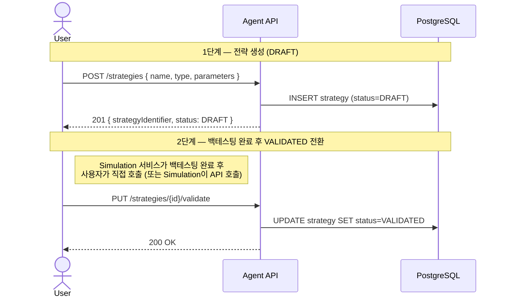
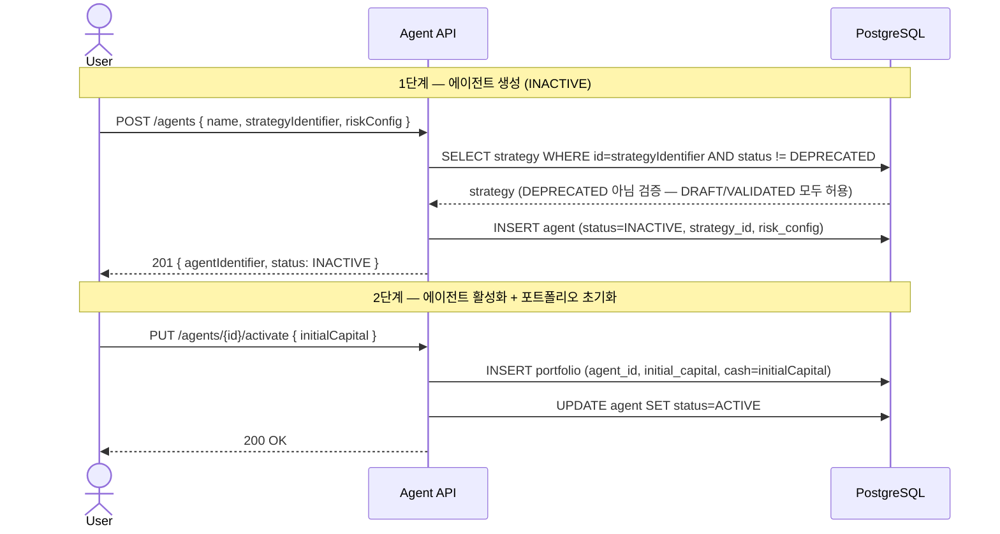
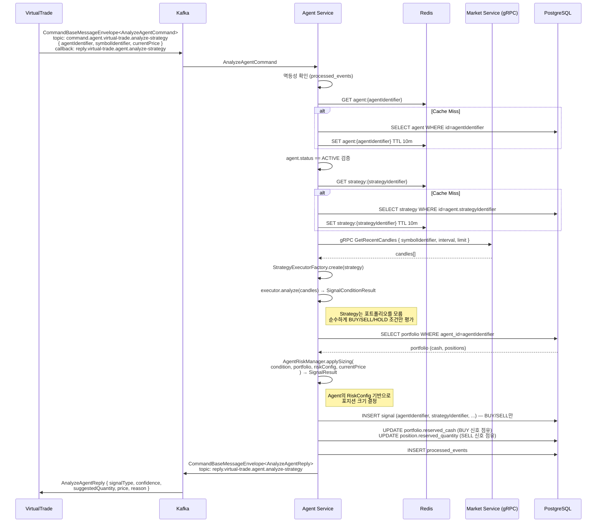
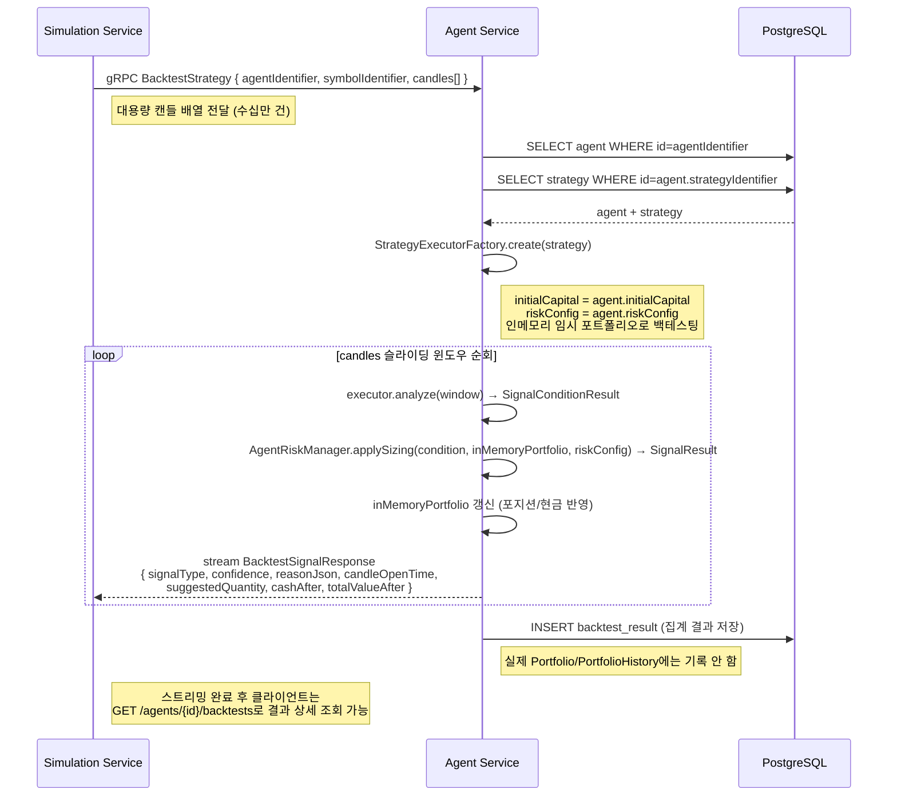
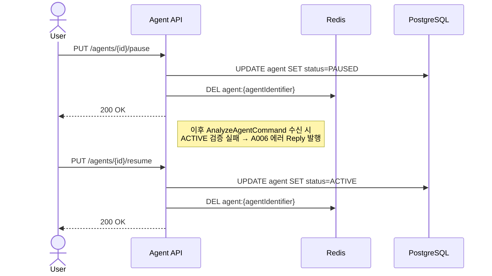
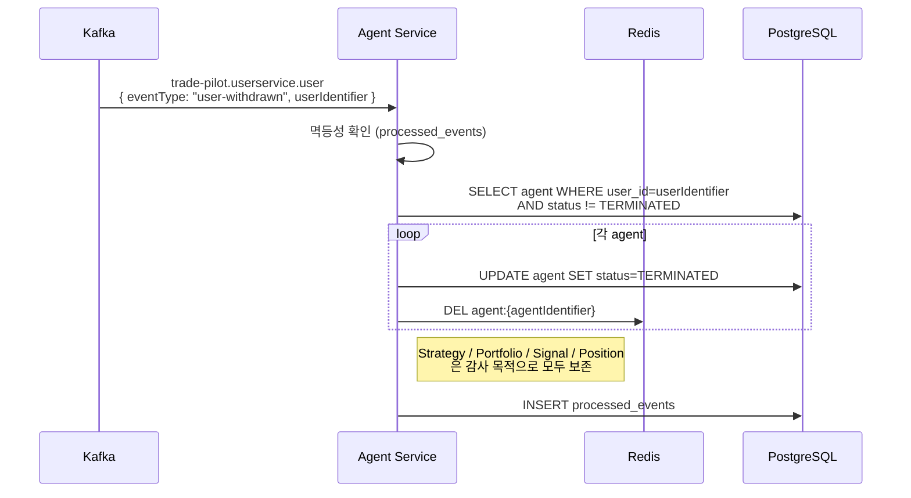

# Agent Service — Sequence Diagram

## 1. 전략 생성 및 검증

---

## 2. 에이전트 생성 및 활성화

---

## 3. 신호 생성 — Kafka Command/Reply

---

## 4. 백테스팅 — gRPC Server Streaming (Simulation)

---

## 5. 에이전트 일시 중지 / 재개

---

## 6. 회원 탈퇴 처리 (UserWithdrawnEvent)

