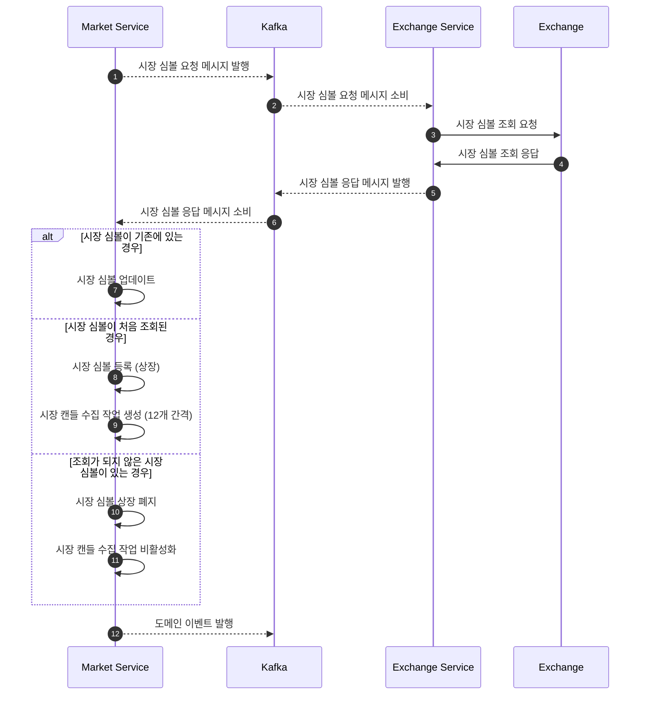
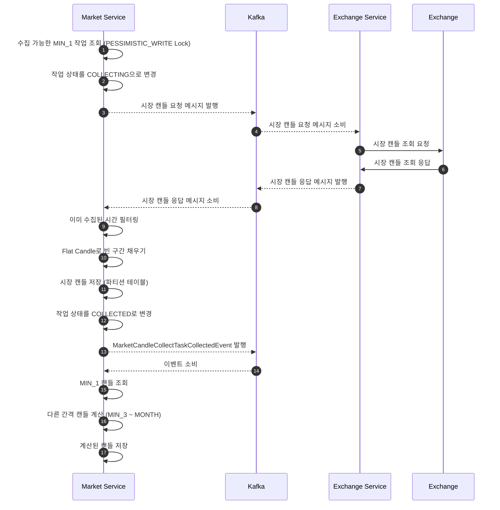

# Market Service 설계

## 개요

Market Service는 시장 데이터 수집 및 제공을 담당하는 서비스입니다.

- **언어**: Kotlin 2.0.21
- **프레임워크**: Spring Boot 3.4.0
- **아키텍처**: Hexagonal Architecture (Ports & Adapters)
- **데이터베이스**: PostgreSQL (파티션 테이블)
- **메시징**: Apache Kafka

## 액션 플로우

### 거래 종목 수집

1. **스케줄러**: 매일 09:00(KST)에 시장 심볼 수집 작업이 시작됩니다.
2. **커맨드 발행**: COIN 시장에 대한 심볼 조회 커맨드를 Kafka로 발행합니다.
3. **외부 시스템**: Exchange Service가 거래소 API를 호출하여 심볼 목록을 조회합니다.
4. **응답 수신**: 수집된 심볼 데이터를 Kafka Reply로 수신합니다.
5. **데이터 처리**:
   - KRW로 시작하는 코인만 필터링합니다.
   - 신규 심볼은 `상장됨` 상태로 등록하고 캔들 수집 작업을 생성합니다.
   - 기존 심볼의 상태가 변경된 경우 업데이트합니다.
   - 조회되지 않은 기존 심볼은 `상장 폐지` 상태로 변경하고 수집 작업을 비활성화합니다.
6. **이벤트 발행**: 각 상태 변경에 대한 도메인 이벤트를 Kafka로 발행합니다.

### 캔들 데이터 수집

1. **스케줄러**: 매 분 0초에 캔들 수집 작업이 시작됩니다.
2. **작업 선택**: 수집 가능한 상태(`CREATED`, `COLLECTED`)의 MIN_1 간격 작업을 조회합니다.
3. **상태 변경**: 선택된 작업들을 `COLLECTING` 상태로 변경합니다 (PESSIMISTIC_WRITE Lock).
4. **커맨드 발행**: 각 작업에 대해 캔들 조회 커맨드를 Kafka로 발행합니다.
5. **외부 시스템**: Exchange Service가 거래소 API를 호출하여 최근 1분봉 데이터를 조회합니다.
6. **응답 수신**: 수집된 캔들 데이터를 Kafka Reply로 수신합니다.
7. **데이터 처리**:
   - 이미 수집된 시간대는 필터링합니다.
   - 데이터가 없는 구간은 Flat Candle(이전 종가로 채워진 캔들)로 생성합니다.
   - 캔들 데이터를 파티션 테이블에 저장합니다.
8. **상태 변경**: 작업을 `COLLECTED` 상태로 변경하고 수집 완료 이벤트를 발행합니다.
9. **간격 계산**:
   - MIN_1 캔들을 기준으로 다른 간격(MIN_3, MIN_5, ..., MONTH)의 캔들을 계산합니다.
   - 계산된 캔들을 저장합니다.

### 실패 처리

1. **수집 실패**: 외부 시스템에서 실패 응답이 오면 작업 상태를 `ERROR`로 변경합니다.
2. **재시작**: 관리 API를 통해 에러 상태의 작업을 수동으로 재시작할 수 있습니다.

### 파티션 관리

1. **스케줄러**: 매월 1일 자정에 파티션 생성 작업이 실행됩니다.
2. **파티션 생성**: 다음 달의 캔들 데이터를 저장할 파티션 테이블을 생성합니다.

## 도메인 정의

### MarketSymbol (시장 심볼)

시장에서 거래 가능한 자산을 식별하는 도메인 객체입니다.

**생명 주기**:
- 거래소에 신규 상장되거나 거래소를 추가할 때 생성됩니다.
- 거래 가능 상태가 변경되거나 상장 폐지될 때 업데이트됩니다.
- 현재 COIN(암호화폐) 시장을 지원하며, KRW 마켓만 수집합니다.

**상태 정의**:
- `LISTED` (상장됨): 정상적으로 거래 가능한 상태
- `WARNING` (경고됨): 거래에 주의가 필요한 상태
- `CAUTION` (주의됨): 거래에 주의가 필요한 상태
- `TRADING_HALTED` (거래 중지): 일시적으로 거래가 중지된 상태
- `DELISTED` (상장 폐지): 거래소에서 제외된 상태

| **프로퍼티 (한글)** | **프로퍼티 (영문)** | **개념**                                     | **필수** | **불변** |
|:--------------------|:--------------------|:--------------------------------------------|:---------|:---------|
| 식별자              | identifier          | 시장 심볼을 식별하기 위한 UUID               | O        | O        |
| 코드                | code                | 거래소에서 사용하는 심볼 코드 (예: KRW-BTC)  | O        | O        |
| 이름                | name                | 심볼의 표시 이름 (예: 비트코인)              | O        | O        |
| 시장                | market              | 시장 타입 (COIN, STOCK)                      | O        | O        |
| 상태                | status              | 시장 심볼의 현재 상태                        | O        | X        |
| 생성일              | created_date        | 시장 심볼이 생성된 시각                      | O        | O        |
| 수정일              | modified_date       | 시장 심볼이 마지막으로 수정된 시각           | O        | X        |

**비즈니스 메서드**:
- `list()`: 상장 상태로 변경하고 `MarketSymbolListedEvent` 발행
- `warning()`: 경고 상태로 변경하고 `MarketSymbolWarningEvent` 발행
- `caution()`: 주의 상태로 변경하고 `MarketSymbolCautionEvent` 발행
- `tradingHalt()`: 거래 중지 상태로 변경하고 `MarketSymbolTradingHaltedEvent` 발행
- `delist()`: 상장 폐지 상태로 변경하고 `MarketSymbolDelistedEvent` 발행

**도메인 이벤트**:
- `MarketSymbolListedEvent`: 신규 심볼 상장 시 → 캔들 수집 작업 생성 트리거
- `MarketSymbolWarningEvent`: 경고 상태 변경 시
- `MarketSymbolCautionEvent`: 주의 상태 변경 시
- `MarketSymbolTradingHaltedEvent`: 거래 중지 시
- `MarketSymbolDelistedEvent`: 상장 폐지 시 → 캔들 수집 작업 비활성화 트리거

### MarketCandleCollectTask (시장 캔들 수집 작업)

시장 캔들 데이터를 수집하는 작업을 관리하는 도메인 객체입니다.

**생명 주기**:
- 시장 심볼이 `상장됨` 상태로 변경될 때 12개 간격의 수집 작업이 자동 생성됩니다.
- MIN_1 간격 작업만 실제 수집을 수행하고, 나머지 간격은 계산으로 생성됩니다.
- 시장 심볼이 `상장 폐지` 상태로 변경되면 모든 수집 작업이 `DELISTED` 상태로 변경됩니다.

**상태 정의**:
- `CREATED`: 작업이 생성되었으나 아직 수집을 시작하지 않은 상태
- `COLLECTING`: 현재 수집 중인 상태
- `COLLECTED`: 수집이 완료된 상태 (다음 수집 대기)
- `DELISTED`: 심볼 상장 폐지로 인해 비활성화된 상태
- `ERROR`: 수집 중 오류가 발생한 상태
- `PAUSED`: 수동으로 일시 정지된 상태

**상태 전이 규칙**:
- 수집 시작 가능 상태: `CREATED`, `COLLECTED`
- 일시 정지 가능 상태: `CREATED`, `COLLECTING`, `COLLECTED`, `ERROR`

| **프로퍼티 (한글)** | **프로퍼티 (영문)**        | **개념**                    | **필수** | **불변** |
|:--------------------|:---------------------------|:----------------------------|:---------|:---------|
| 식별자              | identifier                 | 수집 작업의 고유 UUID        | O        | O        |
| 시장심볼식별자      | symbol_identifier          | 수집 대상 시장 심볼의 식별자 | O        | O        |
| 시간 간격           | interval                   | 캔들 시간 간격               | O        | O        |
| 생성일시            | created_date               | 수집 작업이 생성된 시각      | O        | O        |
| 최근 수집된 일시    | last_collected_time        | 최근 캔들이 수집된 시각      | X        | X        |
| 최근 수집된 가격    | last_collected_price       | 최근 캔들의 종가             | X        | X        |
| 상태                | status                     | 수집 작업의 현재 상태        | O        | X        |

**지원하는 캔들 간격** (총 12개):
- 분봉: `MIN_1`, `MIN_3`, `MIN_5`, `MIN_10`, `MIN_15`, `MIN_30`
- 시간봉: `MIN_60` (1시간), `MIN_120` (2시간), `MIN_180` (3시간)
- 일봉/주봉/월봉: `DAY`, `WEEK`, `MONTH`

**비즈니스 메서드**:
- `list()`: 수집 완료 상태로 변경
- `delist()`: 상장 폐지 상태로 변경
- `collectStart()`: 수집 시작 (상태를 `COLLECTING`으로 변경)
- `collectComplete(candles)`: 수집 완료 처리 (캔들 데이터와 함께)
- `collectComplete()`: 수집 완료 처리 (캔들 데이터 없이, Flat Candle 생성용)
- `collectFail()`: 수집 실패 처리 (상태를 `ERROR`로 변경)
- `collectPause()`: 수집 일시 정지

**동시성 제어**:
- 수집 시작 시 PESSIMISTIC_WRITE Lock을 사용하여 동일 작업의 중복 수집을 방지합니다.

### MarketCandle (시장 캔들)

특정 기간 동안의 시장 가격 데이터를 나타내는 불변 값 객체(Value Object)입니다.

**특징**:
- 시가(Open), 고가(High), 저가(Low), 종가(Close), 거래량(Volume), 거래금액(Amount)으로 구성됩니다.
- 한 번 저장되면 수정되지 않는 불변 데이터입니다.
- 복합 키(Composite Key)로 구성: `symbol_identifier` + `interval` + `time`
- 월별 파티션 테이블로 저장되어 대용량 데이터를 효율적으로 관리합니다.

**데이터 품질 보장**:
- **Flat Candle**: 데이터가 없는 시간대는 이전 종가로 채워진 캔들을 자동 생성합니다.
  - `open = high = low = close = 이전 종가`
  - `volume = amount = 0`
- **간격 계산**: MIN_1 기준 캔들로부터 다른 간격의 캔들을 자동 계산합니다.
  - 같은 시간대의 캔들을 결합: `open=첫값`, `high=최댓값`, `low=최솟값`, `close=마지막값`
  - 거래량과 거래금액은 합산

**간격 계층 구조**:
```
MIN_1 (외부 수집)
├─ MIN_3 ← MIN_1
│  ├─ MIN_10 ← MIN_3
│  └─ MIN_15 ← MIN_3
├─ MIN_5 ← MIN_1
│  └─ MIN_30 ← MIN_5
│     └─ MIN_60 ← MIN_30
│        ├─ MIN_120 ← MIN_60
│        └─ MIN_180 ← MIN_60
│           └─ DAY ← MIN_180
│              ├─ WEEK ← DAY
│              └─ MONTH ← DAY
```

| **프로퍼티 (한글)** | **프로퍼티 (영문)**     | **개념**                                       | **필수** | **불변** |
|:--------------------|:------------------------|:----------------------------------------------|:---------|:---------|
| 시장심볼식별자      | symbol_identifier       | 캔들이 속한 시장 심볼의 식별자                 | O        | O        |
| 시간간격            | interval                | 캔들의 시간 간격 (MIN_1, MIN_5, DAY 등)       | O        | O        |
| 시각                | time                    | 캔들 기간의 시작 시각 (UTC)                    | O        | O        |
| 시가                | open                    | 해당 기간의 시작 가격                          | O        | O        |
| 고가                | high                    | 해당 기간의 최고 가격                          | O        | O        |
| 저가                | low                     | 해당 기간의 최저 가격                          | O        | O        |
| 종가                | close                   | 해당 기간의 마지막 가격                        | O        | O        |
| 거래량              | volume                  | 해당 기간의 총 거래량                          | O        | O        |
| 거래금액            | amount                  | 해당 기간의 총 거래 금액                       | O        | O        |

## API 엔드포인트

### 시장 심볼 API

#### GET /market-symbols
시장 타입별 시장 심볼 목록을 조회합니다.

**요청 파라미터**:
- `markets` (optional): 조회할 시장 타입 목록 (예: `COIN`, `STOCK`)

**응답 예시**:
```json
[
  {
    "identifier": "uuid",
    "code": "KRW-BTC",
    "name": "비트코인",
    "market": "COIN",
    "status": "LISTED",
    "createdDate": "2024-01-15T10:30:00Z",
    "modifiedDate": "2024-01-15T10:30:00Z"
  }
]
```

### 시장 캔들 API

#### GET /market-candle-collect-task-status
수집 작업 상태별 통계를 조회합니다.

#### GET /market-candle-collect-tasks
수집 작업 목록을 조회합니다.

**요청 파라미터**:
- `keyword` (optional): 심볼 코드/이름 검색
- `markets` (optional): 시장 타입 필터
- `intervals` (optional): 캔들 간격 필터
- `statuses` (optional): 수집 작업 상태 필터
- `symbolCursor` (optional): 페이징 커서 (심볼 식별자)
- `intervalCursor` (optional): 페이징 커서 (간격)
- `limit` (optional): 조회 개수 (기본값: 100)

#### GET /symbols/{symbolIdentifier}/intervals/{interval}/market-candles
특정 심볼의 캔들 데이터를 조회합니다.

**요청 파라미터**:
- `orderBy` (optional): 정렬 순서 (ASC, DESC, 기본값: DESC)
- `cursor` (optional): 시간 커서 (기본값: 현재 시간)
- `limit` (optional): 조회 개수 (기본값: 100)

#### GET /market-candles/search
쿼리 기반 캔들 데이터를 검색합니다.

#### PUT /market-candle-collect-tasks/resume-all
모든 수집 작업을 재시작합니다.

#### PUT /market-candle-collect-tasks/pause-all
모든 수집 작업을 일시정지합니다.

#### PUT /market-candle-collect-task/{taskIdentifier}/resume
특정 수집 작업을 재시작합니다.

#### PUT /market-candle-collect-task/{taskIdentifier}/pause
특정 수집 작업을 일시정지합니다.

## 데이터베이스 스키마

### market_symbol 테이블
```sql
CREATE TABLE IF NOT EXISTS market_symbol (
    identifier    UUID                     NOT NULL,
    code          VARCHAR                  NOT NULL,
    name          VARCHAR                  NOT NULL,
    market        VARCHAR                  NOT NULL,
    status        VARCHAR                  NOT NULL,
    created_date  TIMESTAMP WITH TIME ZONE NOT NULL,
    modified_date TIMESTAMP WITH TIME ZONE NOT NULL,
    PRIMARY KEY (identifier)
);
```

### market_candle_collect_task 테이블
```sql
CREATE TABLE IF NOT EXISTS market_candle_collect_task (
    identifier           UUID                     NOT NULL,
    symbol_identifier    UUID                     NOT NULL,
    interval             VARCHAR                  NOT NULL,
    created_date         TIMESTAMP WITH TIME ZONE NOT NULL,
    last_collected_time  TIMESTAMP WITH TIME ZONE,
    last_collected_price DECIMAL,
    status               VARCHAR                  NOT NULL,
    PRIMARY KEY (identifier)
);

CREATE INDEX IF NOT EXISTS collect_task_idx
    ON market_candle_collect_task (symbol_identifier, interval);
```

### market_candle 테이블 (파티션 테이블)
```sql
CREATE TABLE IF NOT EXISTS market_candle (
    symbol_identifier UUID                     NOT NULL,
    interval          VARCHAR                  NOT NULL,
    time              TIMESTAMP WITH TIME ZONE NOT NULL,
    open              DECIMAL                  NOT NULL,
    high              DECIMAL                  NOT NULL,
    low               DECIMAL                  NOT NULL,
    close             DECIMAL                  NOT NULL,
    volume            DECIMAL                  NOT NULL,
    amount            DECIMAL                  NOT NULL,
    PRIMARY KEY (symbol_identifier, interval, time)
) PARTITION BY RANGE (time);

CREATE INDEX IF NOT EXISTS candle_idx
    ON market_candle (symbol_identifier, interval, time);
```

**파티션 관리**:
- 월별 파티션으로 데이터를 분할하여 대용량 데이터를 효율적으로 관리합니다.
- 매월 1일 자정에 스케줄러가 다음 달의 파티션을 자동 생성합니다.

## 스케줄러

### 시장 심볼 수집 스케줄러
**실행 주기**: 매일 09:00 (KST)
**Cron**: `0 0 9 1/1 * *`
**기능**: COIN 시장의 심볼 수집 작업을 시작합니다.

### 시장 캔들 수집 스케줄러
**실행 주기**: 매 분 0초
**Cron**: `0 * * * * *`
**기능**: COIN 시장의 MIN_1 간격 캔들 수집 작업을 시작합니다.

### 파티션 생성 스케줄러
**실행 주기**: 매월 1일 00:00
**Cron**: `0 0 0 1 * *`
**기능**: 다음 달의 market_candle 파티션 테이블을 생성합니다.

## 메시징 (Kafka)

### 시장 심볼 메시지

#### Command Message
- **Topic**: `FIND_ALL_MARKET_SYMBOL_COMMAND_TOPIC`
- **발행자**: MarketSymbolCommandMessageAdapter
- **기능**: Exchange Service에 심볼 목록 조회 요청

#### Reply Message
- **Topic**: `FIND_ALL_MARKET_SYMBOL_REPLY_TOPIC`
- **소비자**: MarketSymbolReplyListener
- **기능**: 수집된 심볼 데이터 수신 및 업데이트

### 시장 캔들 메시지

#### Command Message
- **Topic**: `FIND_ALL_MARKET_CANDLE_COMMAND_TOPIC`
- **발행자**: MarketCandleCommandMessageAdapter
- **기능**: Exchange Service에 캔들 데이터 조회 요청

#### Reply Message (Success)
- **Topic**: `FIND_ALL_MARKET_CANDLE_REPLY_TOPIC`
- **소비자**: MarketCandleCommandMessageListener
- **기능**: 수집된 캔들 데이터 수신 및 저장

#### Reply Message (Failure)
- **Topic**: `FIND_ALL_MARKET_CANDLE_REPLY_FAILURE_TOPIC`
- **소비자**: MarketCandleCommandMessageListener
- **기능**: 수집 실패 시 작업 상태를 ERROR로 변경

### 도메인 이벤트 (Kafka)

#### 시장 심볼 이벤트
- `MarketSymbolListedEvent`: 신규 심볼 상장
- `MarketSymbolWarningEvent`: 경고 상태 변경
- `MarketSymbolCautionEvent`: 주의 상태 변경
- `MarketSymbolTradingHaltedEvent`: 거래 중지
- `MarketSymbolDelistedEvent`: 상장 폐지

#### 시장 캔들 수집 작업 이벤트
- `MarketCandleCollectTaskCollectedEvent`: MIN_1 캔들 수집 완료 → 다른 간격 캔들 계산 트리거

### 특수 기능

#### Agent를 위한 캔들 데이터 제공
- **Command Topic**: `FIND_ALL_MARKET_CANDLE_FOR_AGENT_COMMAND_TOPIC`
- **Reply Topic**: `FIND_ALL_MARKET_CANDLE_FOR_AGENT_REPLY_TOPIC`
- **기능**: AI Agent가 요청한 시점의 모든 심볼 캔들 데이터 제공
- **특징**: riskFreeRate, marketIndex 등 특수 심볼의 시작/현재 캔들 포함

## 시퀀스 다이어그램

### 시장 심볼 수집


```mermaid
sequenceDiagram
    participant m as Market Service
    participant k as Kafka
    participant e as Exchange Service
    participant ex as Exchange

    autoNumber

    m -->> k : 시장 심볼 요청 메시지 발행
    k -->> e : 시장 심볼 요청 메시지 소비
    e ->> ex : 시장 심볼 조회 요청
    ex ->> e : 시장 심볼 조회 응답
    e -->> k : 시장 심볼 응답 메시지 발행
    k -->> m : 시장 심볼 응답 메시지 소비

    alt 시장 심볼이 기존에 있는 경우
        m ->> m : 시장 심볼 업데이트
    else 시장 심볼이 처음 조회된 경우
        m ->> m : 시장 심볼 등록 (상장)
        m ->> m : 시장 캔들 수집 작업 생성 (12개 간격)
    else 조회가 되지 않은 시장 심볼이 있는 경우
        m ->> m : 시장 심볼 상장 폐지
        m ->> m : 시장 캔들 수집 작업 비활성화
    end

    m -->> k : 도메인 이벤트 발행
```

### 시장 캔들 수집


```mermaid
sequenceDiagram
    participant m as Market Service
    participant k as Kafka
    participant e as Exchange Service
    participant ex as Exchange

    autoNumber

    m ->> m : 수집 가능한 MIN_1 작업 조회 (PESSIMISTIC_WRITE Lock)
    m ->> m : 작업 상태를 COLLECTING으로 변경

    m -->> k : 시장 캔들 요청 메시지 발행
    k -->> e : 시장 캔들 요청 메시지 소비
    e ->> ex : 시장 캔들 조회 요청
    ex ->> e : 시장 캔들 조회 응답
    e -->> k : 시장 캔들 응답 메시지 발행
    k -->> m : 시장 캔들 응답 메시지 소비

    m ->> m : 이미 수집된 시간 필터링
    m ->> m : Flat Candle로 빈 구간 채우기
    m ->> m : 시장 캔들 저장 (파티션 테이블)
    m ->> m : 작업 상태를 COLLECTED로 변경

    m -->> k : MarketCandleCollectTaskCollectedEvent 발행
    k -->> m : 이벤트 소비

    m ->> m : MIN_1 캔들 조회
    m ->> m : 다른 간격 캔들 계산 (MIN_3 ~ MONTH)
    m ->> m : 계산된 캔들 저장
```

## 아키텍처

### Hexagonal Architecture

프로젝트는 명확한 레이어 분리를 통해 비즈니스 로직과 외부 시스템을 분리합니다.

```
├─ domain/              # 도메인 모델 (순수 비즈니스 로직)
│  ├─ MarketSymbol
│  ├─ MarketCandleCollectTask
│  └─ MarketCandle
│
├─ application/         # 애플리케이션 서비스 (Use Case)
│  ├─ port/
│  │  ├─ input/        # Use Cases (Input Ports)
│  │  └─ output/       # Output Ports
│  └─ service/         # 비즈니스 로직 오케스트레이션
│
└─ adapter/            # 어댑터 (외부 시스템 통합)
   ├─ input/           # Inbound Adapters
   │  ├─ web/          # REST Controller
   │  ├─ batch/        # Scheduler
   │  ├─ commandmessage/ # Kafka Consumer
   │  └─ event/        # Event Listener
   └─ output/          # Outbound Adapters
      ├─ persistence/  # Database
      ├─ commandmessage/ # Kafka Producer
      └─ event/        # Event Publisher
```

### 주요 설계 원칙

1. **Domain-Driven Design (DDD)**
   - Aggregate Root: MarketSymbol, MarketCandleCollectTask
   - Value Object: MarketCandle
   - Factory Pattern: 도메인 객체 생성 로직 분리
   - Domain Events: 상태 변경 이벤트 발행

2. **Event-Driven Architecture**
   - Internal Events: Spring ApplicationEvent (같은 서비스 내)
   - External Events: Kafka (다른 서비스와 통신)
   - 느슨한 결합과 확장성 확보

3. **성능 최적화**
   - Virtual Threads: Kafka Listener Concurrency 1000
   - Pessimistic Lock: 동시성 제어 (수집 작업)
   - Partition Table: 시간 기반 월별 파티션
   - QueryDSL: 동적 쿼리 및 타입 안정성

4. **데이터 품질**
   - Flat Candle: 데이터 누락 구간 자동 보정
   - Interval Calculation: 기준 간격으로부터 자동 계산
   - Duplicate Prevention: 이미 수집된 시간 필터링
