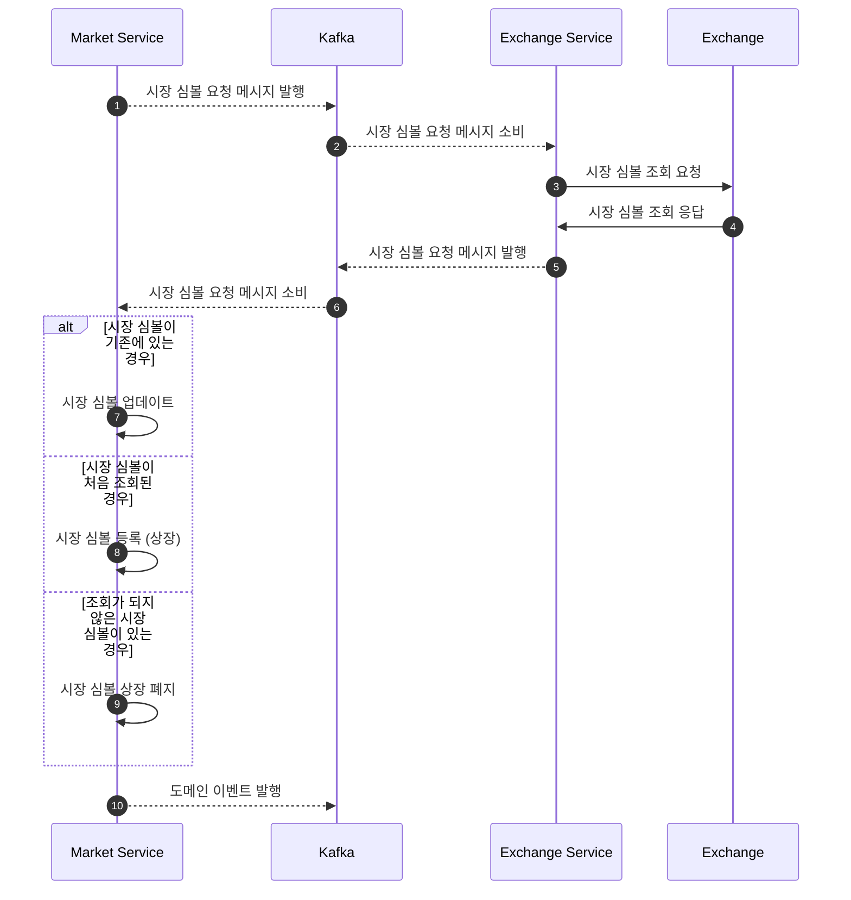
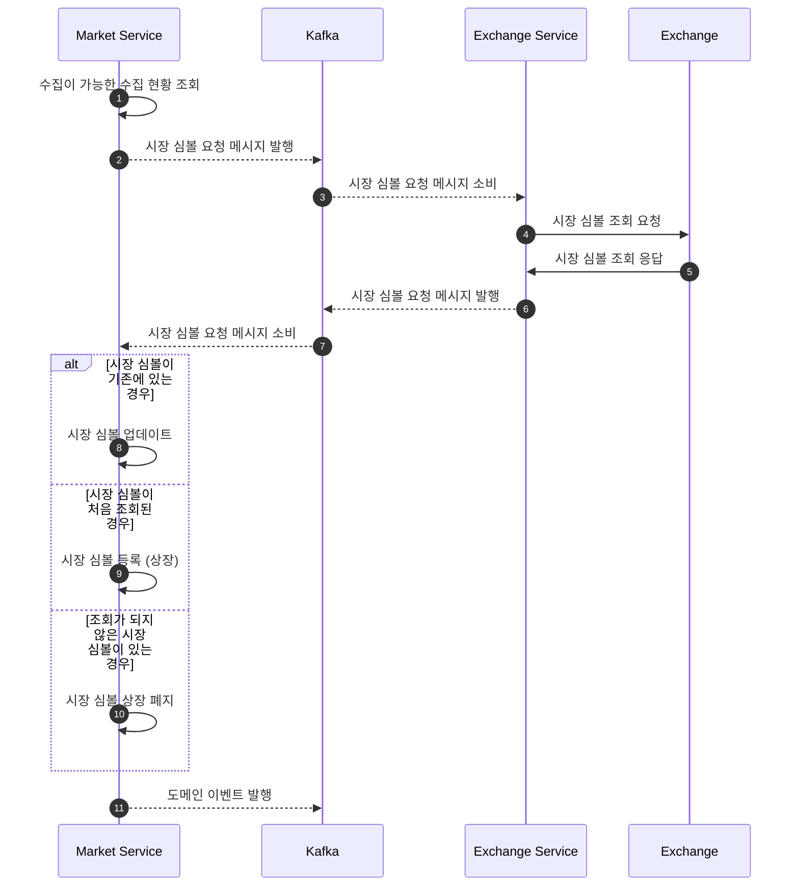

## Action Flow

### 거래 종목 수집

1. 하루에 한번 거래소에 거래 종목을 조회한다.
2. 현재 데이터베이스에 있는 거래 종목 상태와 비교하여 현황을 업데이트 한다.

### 데이터 수집

1. 매 분마다 거래소에 최근 1분봉 가격 정보를 요청한다.
2. 가격 정보를 저장하고 수집 현황을 최신화 한다.
3. 수집된 데이터를 바탕으로 여러 단위의 데이터를 계산한다.
4. 계산된 데이터를 저장한다.

## Domain Definition

### MarketSymbol (시장심볼)

- 시작에서 거래 가능한 자산을 식별할 수 있는 식별 정보이다.
- 거래소를 추가하거나 신규 상장된 경우 생성되며
- 시장 심볼이 등록된 시장은 주식, 코인 등이 있다.
- 거래 가능 상태가 변경되거나, 상장 폐지될 때 업데이트 된다.
- 시장 심볼의 상태는 `상장됨`, `주의됨`, `경고됨`, `거래 중지`, `상장 폐지`가 있다.

| **프로퍼티 (한글)** | **프로퍼티 (영문)** | **개념**                                     | **필수** | **불변** |
| ------------------- | ------------------- | -------------------------------------------- | -------- | -------- |
| 식별자              | identifier          | 시장 심볼을 식별하기 위한 식별자             | O        | O        |
| 코드                | code                | 거래소에서 시장 심볼을 식별하기 위한 식별 값 | O        | O        |
| 시장                | market              | 시장 심볼이 등록된 거래소 유형               | O        | O        |
| 상태                | status              | 시장 심볼의 상태                             | O        | O        |
| 생성일              | created_date        | 시장 심볼이 생성된 시각                      | O        | O        |
| 수정일              | modified_date       | 시장 심볼이 수정된 시각                      | O        | O        |

### MarketCandleCollectStatus (시장 캔들 수집 상태)

- 시장 캔들을 수집하는 상태를 관리하는 정보이다.
- 시장 심볼이 상장되는 시점에 생성되며, 상장 폐지 시 비활성화 된다.

| **프로퍼티 (한글)** | **프로퍼티 (영문)** | **개념**                                  | **필수** | **불변** |
| ------------------- | ------------------- | ----------------------------------------- | -------- | -------- |
| 식별자              | identifier          | 시장 캔들 수집 상태 식별자                | O        | O        |
| 시장심볼식별자      | symbol_identifier   | 상태를 관리하는 시장 심볼의 식별자        | O        | O        |
| 생성일시            | created_date            | 수집 상태가 생성된 시각                     | O        | O        |
| 최근 수집된 일시            | last_collected_date            | 최근에 시장 캔들이 수집된 일시                     | O        | O        |

### MarketCandle (시장 캔들)

- 특정 기간 동안의 시장 가격 데이터를 나타내는 정보이다.
- 1분, 5분, 15분, 30분, 1시간, 4시간, 1일 등의 다양한 시간 간격으로 생성된다.
- 시가, 고가, 저가, 종가와 거래량 정보를 포함한다.
- 기술적 분석과 차트 시각화에 사용되는 핵심 데이터이다.
- 실시간으로 업데이트되며, 과거 데이터는 불변으로 유지된다.

| **프로퍼티 (한글)** | **프로퍼티 (영문)** | **개념**                                  | **필수** | **불변** |
| ------------------- | ------------------- | ----------------------------------------- | -------- | -------- |
| 식별자              | identifier          | 캔들 데이터를 식별하기 위한 고유 식별자   | O        | O        |
| 시장심볼식별자      | symbol_identifier   | 캔들이 속한 시장 심볼의 식별자            | O        | O        |
| 시간간격            | interval            | 캔들의 시간 간격 (1m, 5m, 15m, 1h, 1d 등) | O        | O        |
| 시가                | open_price          | 해당 기간의 시작 가격                     | O        | O        |
| 고가                | high_price          | 해당 기간의 최고 가격                     | O        | O        |
| 저가                | low_price           | 해당 기간의 최저 가격                     | O        | O        |
| 종가                | close_price         | 해당 기간의 마지막 가격                   | O        | O        |
| 거래량              | volume              | 해당 기간의 총 거래량                     | O        | O        |
| 거래금액            | quote_volume        | 해당 기간의 총 거래 금액                  | O        | O        |
| 시작시각            | start_time          | 캔들 기간의 시작 시각                     | O        | O        |
| 종료시각            | end_time            | 캔들 기간의 종료 시각                     | O        | O        |

## Sequence Diagram

### 시장 심볼 수집

### 시장 캔들 수집

