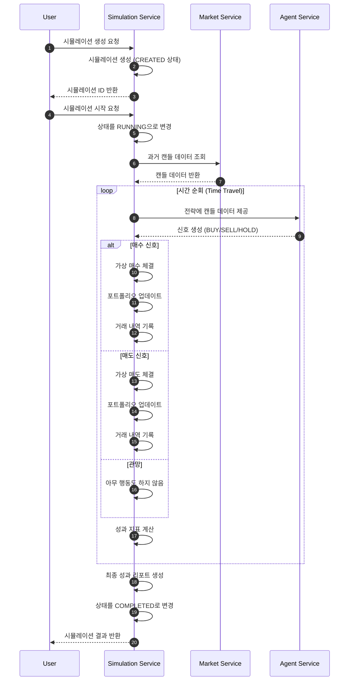

# Simulation Service 설계

## 개요

Simulation Service는 과거 데이터를 기반으로 거래 전략을 검증하는 백테스팅 시스템입니다.

- **언어**: Kotlin 2.0.21
- **프레임워크**: Spring Boot 3.4.0
- **아키텍처**: Hexagonal Architecture (Ports & Adapters)
- **데이터베이스**: PostgreSQL
- **메시징**: Apache Kafka

## 핵심 개념

### Backtesting이란?
과거의 시장 데이터를 재생하여 전략의 성과를 검증하는 프로세스입니다.

```
과거 데이터 → 전략 실행 → 성과 측정 → 리포트 생성
```

**목적**:
- 전략의 수익성 검증
- 리스크 분석
- 최적 파라미터 탐색
- 과적합 방지

## 액션 플로우

### 시뮬레이션 실행



---

## 도메인 정의

### Simulation (시뮬레이션)

백테스팅 실행 단위를 나타내는 도메인 객체입니다.

**생명 주기**:
- 사용자가 시뮬레이션을 생성하면 `CREATED` 상태로 시작합니다.
- 실행을 시작하면 `RUNNING` 상태가 됩니다.
- 완료되면 `COMPLETED` 상태로 변경됩니다.
- 실행 중 오류가 발생하면 `FAILED` 상태로 변경됩니다.

**상태 정의**:
- `CREATED`: 생성됨 (실행 대기)
- `RUNNING`: 실행 중
- `COMPLETED`: 완료됨
- `FAILED`: 실패함

| **프로퍼티 (한글)** | **프로퍼티 (영문)**  | **개념**                                     | **필수** | **불변** |
|:--------------------|:---------------------|:--------------------------------------------|:---------|:---------|
| 식별자              | identifier           | 시뮬레이션을 식별하기 위한 UUID              | O        | O        |
| 이름                | name                 | 시뮬레이션 이름                              | O        | X        |
| 전략식별자          | strategy_identifier  | 테스트할 전략의 식별자                       | O        | O        |
| 시작일              | start_date           | 백테스팅 시작 시점                           | O        | O        |
| 종료일              | end_date             | 백테스팅 종료 시점                           | O        | O        |
| 초기자본            | initial_capital      | 시작 자본                                    | O        | O        |
| 상태                | status               | 시뮬레이션 현재 상태                         | O        | X        |
| 진행률              | progress             | 진행률 (0 ~ 100)                             | O        | X        |
| 생성일              | created_date         | 시뮬레이션이 생성된 시각                     | O        | O        |
| 시작일시            | started_at           | 시뮬레이션이 시작된 시각                     | X        | O        |
| 종료일시            | completed_at         | 시뮬레이션이 완료된 시각                     | X        | O        |

**비즈니스 메서드**:
- `start()`: 시뮬레이션 시작 (상태를 `RUNNING`으로 변경)
- `updateProgress(progress)`: 진행률 업데이트
- `complete()`: 시뮬레이션 완료 (상태를 `COMPLETED`로 변경)
- `fail(reason)`: 시뮬레이션 실패 처리

---

### SimulationConfig (시뮬레이션 설정)

시뮬레이션 실행에 필요한 설정을 나타내는 값 객체입니다.

| **프로퍼티 (한글)** | **프로퍼티 (영문)**  | **개념**                                     | **필수** | **불변** |
|:--------------------|:---------------------|:--------------------------------------------|:---------|:---------|
| 시뮬레이션식별자    | simulation_identifier| 설정이 속한 시뮬레이션의 식별자              | O        | O        |
| 심볼목록            | symbol_identifiers   | 백테스팅 대상 심볼 목록                      | O        | O        |
| 캔들간격            | candle_interval      | 사용할 캔들 간격 (MIN_1, MIN_5 등)           | O        | O        |
| 거래수수료율        | fee_rate             | 거래 수수료율 (0.0 ~ 1.0)                    | O        | O        |
| 슬리피지율          | slippage_rate        | 슬리피지율 (0.0 ~ 1.0)                       | O        | O        |
| 리밸런싱주기        | rebalance_interval   | 포트폴리오 리밸런싱 주기 (optional)          | X        | O        |

**기본값**:
- `fee_rate`: 0.0005 (0.05%, 업비트 기준)
- `slippage_rate`: 0.001 (0.1%)

---

### SimulationResult (시뮬레이션 결과)

시뮬레이션 실행 후 성과를 나타내는 값 객체입니다.

| **프로퍼티 (한글)** | **프로퍼티 (영문)**        | **개념**                                     | **필수** | **불변** |
|:--------------------|:---------------------------|:--------------------------------------------|:---------|:---------|
| 시뮬레이션식별자    | simulation_identifier      | 결과가 속한 시뮬레이션의 식별자              | O        | O        |
| 최종자본            | final_capital              | 최종 자본                                    | O        | O        |
| 총수익률            | total_return               | 총 수익률 (%)                                | O        | O        |
| 연환산수익률        | annualized_return          | 연환산 수익률 (%)                            | O        | O        |
| 최대낙폭            | max_drawdown               | 최대 낙폭 MDD (%)                            | O        | O        |
| 샤프비율            | sharpe_ratio               | 샤프 비율                                    | O        | O        |
| 소티노비율          | sortino_ratio              | 소티노 비율                                  | O        | O        |
| 승률                | win_rate                   | 승률 (%)                                     | O        | O        |
| 손익비              | profit_loss_ratio          | 평균 수익 / 평균 손실                        | O        | O        |
| 총거래횟수          | total_trades               | 총 거래 횟수                                 | O        | O        |
| 승리거래수          | winning_trades             | 수익이 난 거래 횟수                          | O        | O        |
| 패배거래수          | losing_trades              | 손실이 난 거래 횟수                          | O        | O        |
| 평균보유기간        | avg_holding_period         | 평균 포지션 보유 기간 (초)                   | O        | O        |
| 최대수익거래        | max_profit_trade           | 최대 수익을 낸 거래 금액                     | O        | O        |
| 최대손실거래        | max_loss_trade             | 최대 손실을 낸 거래 금액                     | O        | O        |

**성과 지표 계산 공식**:

#### 1. 총 수익률 (Total Return)
```kotlin
totalReturn = ((finalCapital - initialCapital) / initialCapital) * 100
```

#### 2. 연환산 수익률 (Annualized Return)
```kotlin
val days = ChronoUnit.DAYS.between(startDate, endDate)
val years = days / 365.0
annualizedReturn = ((finalCapital / initialCapital).pow(1 / years) - 1) * 100
```

#### 3. 최대 낙폭 (Maximum Drawdown, MDD)
```kotlin
var peak = initialCapital
var maxDrawdown = 0.0

equityCurve.forEach { equity ->
    if (equity > peak) peak = equity
    val drawdown = ((peak - equity) / peak) * 100
    if (drawdown > maxDrawdown) maxDrawdown = drawdown
}
```

#### 4. 샤프 비율 (Sharpe Ratio)
```kotlin
val returns = calculateDailyReturns(equityCurve)
val avgReturn = returns.average()
val stdDev = calculateStdDev(returns)
val riskFreeRate = 0.02 / 365 // 연 2% 무위험 수익률

sharpeRatio = (avgReturn - riskFreeRate) / stdDev * sqrt(365)
```

#### 5. 소티노 비율 (Sortino Ratio)
샤프 비율과 유사하지만 하방 변동성만 고려합니다.

```kotlin
val returns = calculateDailyReturns(equityCurve)
val avgReturn = returns.average()
val downsideReturns = returns.filter { it < 0 }
val downsideStdDev = calculateStdDev(downsideReturns)
val riskFreeRate = 0.02 / 365

sortinoRatio = (avgReturn - riskFreeRate) / downsideStdDev * sqrt(365)
```

#### 6. 승률 (Win Rate)
```kotlin
winRate = (winningTrades / totalTrades) * 100
```

#### 7. 손익비 (Profit/Loss Ratio)
```kotlin
val avgProfit = winningTrades.map { it.profit }.average()
val avgLoss = losingTrades.map { it.loss }.average()
profitLossRatio = avgProfit / avgLoss
```

---

### SimulationTrade (시뮬레이션 거래 내역)

시뮬레이션 중 발생한 거래 내역을 기록하는 값 객체입니다.

| **프로퍼티 (한글)** | **프로퍼티 (영문)**        | **개념**                                     | **필수** | **불변** |
|:--------------------|:---------------------------|:--------------------------------------------|:---------|:---------|
| 식별자              | identifier                 | 거래 내역 식별자                             | O        | O        |
| 시뮬레이션식별자    | simulation_identifier      | 거래가 발생한 시뮬레이션의 식별자            | O        | O        |
| 심볼식별자          | symbol_identifier          | 거래 대상 심볼의 식별자                      | O        | O        |
| 시각                | time                       | 거래가 발생한 시각                           | O        | O        |
| 타입                | type                       | 거래 타입 (BUY, SELL)                        | O        | O        |
| 수량                | quantity                   | 거래 수량                                    | O        | O        |
| 가격                | price                      | 체결 가격                                    | O        | O        |
| 수수료              | fee                        | 거래 수수료                                  | O        | O        |
| 슬리피지            | slippage                   | 슬리피지 금액                                | O        | O        |
| 총금액              | total_amount               | 거래 총 금액                                 | O        | O        |
| 포지션손익          | position_pnl               | 해당 포지션의 실현 손익 (SELL 시에만)        | X        | O        |

---

### SimulationSnapshot (시뮬레이션 스냅샷)

시뮬레이션 중 특정 시점의 포트폴리오 상태를 기록하는 값 객체입니다.

| **프로퍼티 (한글)** | **프로퍼티 (영문)**        | **개념**                                     | **필수** | **불변** |
|:--------------------|:---------------------------|:--------------------------------------------|:---------|:---------|
| 시뮬레이션식별자    | simulation_identifier      | 스냅샷이 속한 시뮬레이션의 식별자            | O        | O        |
| 시각                | time                       | 스냅샷 시각                                  | O        | O        |
| 현금                | cash                       | 보유 현금                                    | O        | O        |
| 총자산가치          | total_value                | 총 자산 가치                                 | O        | O        |
| 수익률              | return_rate                | 현재까지의 수익률 (%)                        | O        | O        |

**목적**:
- 자산 변동 차트 생성
- 낙폭(Drawdown) 계산

---

## 백테스팅 엔진

### Time Travel 엔진

과거 데이터를 시간 순서대로 재생하는 엔진입니다.

```kotlin
class TimeTravelEngine(
    private val marketService: MarketService,
    private val agentService: AgentService
) {
    fun run(simulation: Simulation, config: SimulationConfig): SimulationResult {
        // 1. 초기화
        val portfolio = Portfolio(
            initialCapital = simulation.initialCapital,
            cash = simulation.initialCapital
        )
        val trades = mutableListOf<SimulationTrade>()
        val snapshots = mutableListOf<SimulationSnapshot>()

        // 2. 시간 범위 계산
        val startTime = simulation.startDate
        val endTime = simulation.endDate
        val interval = config.candleInterval

        // 3. 캔들 데이터 조회
        val candles = marketService.getCandlesForSimulation(
            symbolIdentifiers = config.symbolIdentifiers,
            interval = interval,
            startTime = startTime,
            endTime = endTime
        )

        // 4. 시간 순회
        var currentTime = startTime
        while (currentTime <= endTime) {
            // 4.1. 현재 시점까지의 캔들 데이터
            val historicalCandles = candles.filter { it.time <= currentTime }

            // 4.2. 전략 실행 - 신호 생성
            val signals = config.symbolIdentifiers.map { symbolId ->
                val symbolCandles = historicalCandles.filter {
                    it.symbolIdentifier == symbolId
                }
                agentService.analyze(symbolId, symbolCandles, portfolio)
            }

            // 4.3. 신호 처리 - 주문 실행
            signals.forEach { signal ->
                when (signal.type) {
                    SignalType.BUY -> executeBuy(signal, portfolio, config, trades)
                    SignalType.SELL -> executeSell(signal, portfolio, config, trades)
                    SignalType.HOLD -> {
                        // 아무것도 하지 않음
                    }
                }
            }

            // 4.4. 포트폴리오 가치 계산
            val currentPrices = getCurrentPrices(candles, currentTime)
            portfolio.updateValue(currentPrices)

            // 4.5. 스냅샷 저장 (일 1회)
            if (shouldTakeSnapshot(currentTime, interval)) {
                snapshots.add(
                    SimulationSnapshot(
                        simulationIdentifier = simulation.identifier,
                        time = currentTime,
                        cash = portfolio.cash,
                        totalValue = portfolio.totalValue,
                        returnRate = portfolio.getReturnRate()
                    )
                )
            }

            // 4.6. 진행률 업데이트
            val progress = calculateProgress(startTime, endTime, currentTime)
            simulation.updateProgress(progress)

            // 4.7. 다음 시점으로 이동
            currentTime = currentTime.plus(interval.duration)
        }

        // 5. 최종 결과 계산
        return calculateResult(simulation, portfolio, trades, snapshots)
    }

    private fun executeBuy(
        signal: Signal,
        portfolio: Portfolio,
        config: SimulationConfig,
        trades: MutableList<SimulationTrade>
    ) {
        val orderSize = agentService.calculateOrderSize(signal, portfolio, signal.price)
        if (orderSize <= BigDecimal.ZERO) return

        // 슬리피지 적용 (매수 시 가격 상승)
        val slippage = signal.price * config.slippageRate
        val executionPrice = signal.price + slippage

        // 수수료 계산
        val totalCost = orderSize * executionPrice
        val fee = totalCost * config.feeRate

        // 현금 확인
        if (portfolio.cash < totalCost + fee) {
            // 자금 부족 - 주문 실패
            return
        }

        // 포트폴리오 업데이트
        portfolio.buy(signal.symbolIdentifier, orderSize, executionPrice)
        portfolio.cash -= (totalCost + fee)

        // 거래 내역 기록
        trades.add(
            SimulationTrade(
                simulationIdentifier = signal.strategyIdentifier,
                symbolIdentifier = signal.symbolIdentifier,
                time = signal.time,
                type = TradeType.BUY,
                quantity = orderSize,
                price = executionPrice,
                fee = fee,
                slippage = slippage * orderSize,
                totalAmount = totalCost + fee
            )
        )
    }

    private fun executeSell(
        signal: Signal,
        portfolio: Portfolio,
        config: SimulationConfig,
        trades: MutableList<SimulationTrade>
    ) {
        val position = portfolio.getPosition(signal.symbolIdentifier) ?: return
        val orderSize = agentService.calculateOrderSize(signal, portfolio, signal.price)
        if (orderSize <= BigDecimal.ZERO) return

        // 보유 수량 확인
        val actualSize = minOf(orderSize, position.quantity)

        // 슬리피지 적용 (매도 시 가격 하락)
        val slippage = signal.price * config.slippageRate
        val executionPrice = signal.price - slippage

        // 수수료 계산
        val totalRevenue = actualSize * executionPrice
        val fee = totalRevenue * config.feeRate

        // 포지션 손익 계산
        val positionPnL = (executionPrice - position.averagePrice) * actualSize - fee

        // 포트폴리오 업데이트
        portfolio.sell(signal.symbolIdentifier, actualSize)
        portfolio.cash += (totalRevenue - fee)

        // 거래 내역 기록
        trades.add(
            SimulationTrade(
                simulationIdentifier = signal.strategyIdentifier,
                symbolIdentifier = signal.symbolIdentifier,
                time = signal.time,
                type = TradeType.SELL,
                quantity = actualSize,
                price = executionPrice,
                fee = fee,
                slippage = slippage * actualSize,
                totalAmount = totalRevenue - fee,
                positionPnl = positionPnL
            )
        )
    }
}
```

---

## 최적화 시스템

### Grid Search

파라미터 조합을 체계적으로 탐색하여 최적의 파라미터를 찾는 방법입니다.

```kotlin
class GridSearchOptimizer(
    private val simulationService: SimulationService
) {
    fun optimize(
        strategy: Strategy,
        parameterGrid: Map<String, List<Any>>,
        startDate: LocalDateTime,
        endDate: LocalDateTime,
        initialCapital: BigDecimal
    ): OptimizationResult {
        val results = mutableListOf<Pair<Map<String, Any>, SimulationResult>>()

        // 모든 파라미터 조합 생성
        val combinations = generateCombinations(parameterGrid)

        // 병렬 시뮬레이션 실행
        combinations.parallelStream().forEach { params ->
            // 전략 파라미터 업데이트
            val updatedStrategy = strategy.copy(parameters = params)

            // 시뮬레이션 실행
            val simulation = simulationService.createSimulation(
                strategyIdentifier = updatedStrategy.identifier,
                startDate = startDate,
                endDate = endDate,
                initialCapital = initialCapital
            )
            val result = simulationService.runSimulation(simulation)

            synchronized(results) {
                results.add(params to result)
            }
        }

        // 최적 결과 선택 (샤프 비율 기준)
        val best = results.maxByOrNull { it.second.sharpeRatio }

        return OptimizationResult(
            bestParameters = best?.first ?: emptyMap(),
            bestResult = best?.second,
            allResults = results
        )
    }

    private fun generateCombinations(
        parameterGrid: Map<String, List<Any>>
    ): List<Map<String, Any>> {
        // 재귀적으로 모든 조합 생성
        if (parameterGrid.isEmpty()) return listOf(emptyMap())

        val (key, values) = parameterGrid.entries.first()
        val remaining = parameterGrid - key

        val subCombinations = generateCombinations(remaining)

        return values.flatMap { value ->
            subCombinations.map { combo ->
                combo + (key to value)
            }
        }
    }
}
```

**사용 예시**:
```kotlin
val parameterGrid = mapOf(
    "shortPeriod" to listOf(3, 5, 7, 10),
    "longPeriod" to listOf(15, 20, 25, 30)
)

val result = gridSearchOptimizer.optimize(
    strategy = maCrossoverStrategy,
    parameterGrid = parameterGrid,
    startDate = LocalDateTime.of(2024, 1, 1, 0, 0),
    endDate = LocalDateTime.of(2024, 12, 31, 23, 59),
    initialCapital = BigDecimal("10000000") // 1000만원
)

println("Best Parameters: ${result.bestParameters}")
// 출력: Best Parameters: {shortPeriod=5, longPeriod=20}
```

---

### Walk-Forward Analysis

과적합을 방지하기 위한 검증 기법입니다.

```kotlin
class WalkForwardAnalyzer(
    private val simulationService: SimulationService,
    private val optimizer: GridSearchOptimizer
) {
    fun analyze(
        strategy: Strategy,
        parameterGrid: Map<String, List<Any>>,
        startDate: LocalDateTime,
        endDate: LocalDateTime,
        inSampleRatio: Double = 0.7, // 70%는 최적화, 30%는 검증
        windows: Int = 5
    ): WalkForwardResult {
        val totalDays = ChronoUnit.DAYS.between(startDate, endDate)
        val windowSize = totalDays / windows

        val results = mutableListOf<WindowResult>()

        for (i in 0 until windows) {
            val windowStart = startDate.plusDays(windowSize * i)
            val windowEnd = windowStart.plusDays(windowSize)

            // In-Sample: 최적화 기간
            val inSampleEnd = windowStart.plusDays((windowSize * inSampleRatio).toLong())

            // Out-Sample: 검증 기간
            val outSampleStart = inSampleEnd
            val outSampleEnd = windowEnd

            // In-Sample에서 최적 파라미터 탐색
            val optimizationResult = optimizer.optimize(
                strategy = strategy,
                parameterGrid = parameterGrid,
                startDate = windowStart,
                endDate = inSampleEnd,
                initialCapital = BigDecimal("10000000")
            )

            // Out-Sample에서 검증
            val bestStrategy = strategy.copy(
                parameters = optimizationResult.bestParameters
            )
            val validationSimulation = simulationService.createSimulation(
                strategyIdentifier = bestStrategy.identifier,
                startDate = outSampleStart,
                endDate = outSampleEnd,
                initialCapital = BigDecimal("10000000")
            )
            val validationResult = simulationService.runSimulation(validationSimulation)

            results.add(
                WindowResult(
                    window = i + 1,
                    inSamplePeriod = windowStart to inSampleEnd,
                    outSamplePeriod = outSampleStart to outSampleEnd,
                    optimizedParameters = optimizationResult.bestParameters,
                    inSampleResult = optimizationResult.bestResult,
                    outSampleResult = validationResult
                )
            )
        }

        return WalkForwardResult(
            windows = results,
            averageOutSampleReturn = results.map {
                it.outSampleResult.totalReturn
            }.average()
        )
    }
}
```

---

## API 엔드포인트

### 시뮬레이션 관리 API

#### POST /simulations
새로운 시뮬레이션을 생성합니다.

**요청 예시**:
```json
{
  "name": "MA Crossover 백테스트 2024",
  "strategyIdentifier": "uuid",
  "startDate": "2024-01-01T00:00:00Z",
  "endDate": "2024-12-31T23:59:59Z",
  "initialCapital": 10000000,
  "config": {
    "symbolIdentifiers": ["uuid1", "uuid2"],
    "candleInterval": "MIN_5",
    "feeRate": 0.0005,
    "slippageRate": 0.001
  }
}
```

#### POST /simulations/{simulationIdentifier}/start
시뮬레이션을 시작합니다.

#### GET /simulations/{simulationIdentifier}
시뮬레이션 상세 정보 및 결과를 조회합니다.

#### GET /simulations
시뮬레이션 목록을 조회합니다.

#### DELETE /simulations/{simulationIdentifier}
시뮬레이션을 삭제합니다.

#### GET /simulations/{simulationIdentifier}/trades
시뮬레이션의 거래 내역을 조회합니다.

#### GET /simulations/{simulationIdentifier}/snapshots
시뮬레이션의 자산 변동 스냅샷을 조회합니다.

#### GET /simulations/{simulationIdentifier}/report
시뮬레이션 리포트를 PDF로 다운로드합니다.

### 최적화 API

#### POST /optimizations/grid-search
Grid Search 최적화를 실행합니다.

**요청 예시**:
```json
{
  "strategyIdentifier": "uuid",
  "parameterGrid": {
    "shortPeriod": [3, 5, 7, 10],
    "longPeriod": [15, 20, 25, 30]
  },
  "startDate": "2024-01-01T00:00:00Z",
  "endDate": "2024-12-31T23:59:59Z",
  "initialCapital": 10000000
}
```

#### POST /optimizations/walk-forward
Walk-Forward Analysis를 실행합니다.

---

## 데이터베이스 스키마

### simulation 테이블
```sql
CREATE TABLE IF NOT EXISTS simulation (
    identifier          UUID                     NOT NULL,
    name                VARCHAR                  NOT NULL,
    strategy_identifier UUID                     NOT NULL,
    start_date          TIMESTAMP WITH TIME ZONE NOT NULL,
    end_date            TIMESTAMP WITH TIME ZONE NOT NULL,
    initial_capital     DECIMAL                  NOT NULL,
    status              VARCHAR                  NOT NULL,
    progress            INT                      NOT NULL DEFAULT 0,
    created_date        TIMESTAMP WITH TIME ZONE NOT NULL,
    started_at          TIMESTAMP WITH TIME ZONE,
    completed_at        TIMESTAMP WITH TIME ZONE,
    PRIMARY KEY (identifier)
);

CREATE INDEX IF NOT EXISTS simulation_strategy_idx ON simulation (strategy_identifier);
```

### simulation_config 테이블
```sql
CREATE TABLE IF NOT EXISTS simulation_config (
    simulation_identifier UUID    NOT NULL,
    symbol_identifiers    UUID[]  NOT NULL,
    candle_interval       VARCHAR NOT NULL,
    fee_rate              DECIMAL NOT NULL,
    slippage_rate         DECIMAL NOT NULL,
    rebalance_interval    VARCHAR,
    PRIMARY KEY (simulation_identifier)
);
```

### simulation_result 테이블
```sql
CREATE TABLE IF NOT EXISTS simulation_result (
    simulation_identifier UUID    NOT NULL,
    final_capital         DECIMAL NOT NULL,
    total_return          DECIMAL NOT NULL,
    annualized_return     DECIMAL NOT NULL,
    max_drawdown          DECIMAL NOT NULL,
    sharpe_ratio          DECIMAL NOT NULL,
    sortino_ratio         DECIMAL NOT NULL,
    win_rate              DECIMAL NOT NULL,
    profit_loss_ratio     DECIMAL NOT NULL,
    total_trades          INT     NOT NULL,
    winning_trades        INT     NOT NULL,
    losing_trades         INT     NOT NULL,
    avg_holding_period    BIGINT  NOT NULL,
    max_profit_trade      DECIMAL NOT NULL,
    max_loss_trade        DECIMAL NOT NULL,
    PRIMARY KEY (simulation_identifier)
);
```

### simulation_trade 테이블
```sql
CREATE TABLE IF NOT EXISTS simulation_trade (
    identifier            UUID                     NOT NULL,
    simulation_identifier UUID                     NOT NULL,
    symbol_identifier     UUID                     NOT NULL,
    time                  TIMESTAMP WITH TIME ZONE NOT NULL,
    type                  VARCHAR                  NOT NULL,
    quantity              DECIMAL                  NOT NULL,
    price                 DECIMAL                  NOT NULL,
    fee                   DECIMAL                  NOT NULL,
    slippage              DECIMAL                  NOT NULL,
    total_amount          DECIMAL                  NOT NULL,
    position_pnl          DECIMAL,
    PRIMARY KEY (identifier)
);

CREATE INDEX IF NOT EXISTS simulation_trade_simulation_idx
    ON simulation_trade (simulation_identifier);
CREATE INDEX IF NOT EXISTS simulation_trade_time_idx
    ON simulation_trade (time);
```

### simulation_snapshot 테이블
```sql
CREATE TABLE IF NOT EXISTS simulation_snapshot (
    simulation_identifier UUID                     NOT NULL,
    time                  TIMESTAMP WITH TIME ZONE NOT NULL,
    cash                  DECIMAL                  NOT NULL,
    total_value           DECIMAL                  NOT NULL,
    return_rate           DECIMAL                  NOT NULL,
    PRIMARY KEY (simulation_identifier, time)
);

CREATE INDEX IF NOT EXISTS simulation_snapshot_simulation_idx
    ON simulation_snapshot (simulation_identifier);
```

---

## 다음 단계

- Agent Service와 연동하여 전략 실행
- Market Service에서 과거 데이터 조회
- VirtualTrade Service와 연동 (실시간 가상거래)
