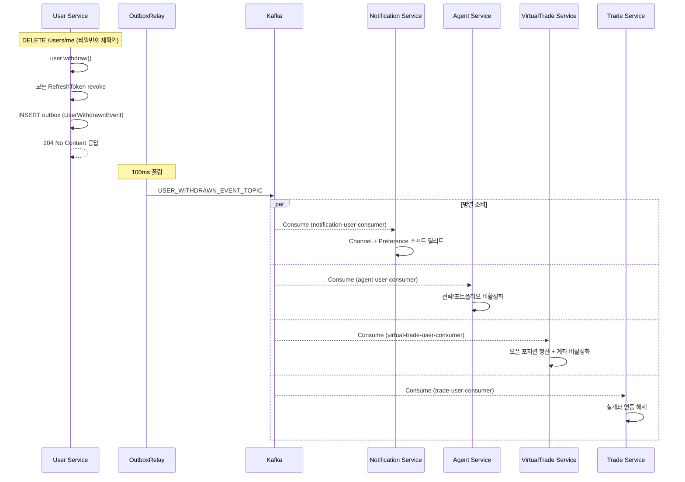

# 이벤트 기반 생명주기 설계

> 사용자 계정 상태 변경 등 도메인 이벤트가 발생했을 때 각 서비스가 수행하는 정리 작업 정의

---

## 1. UserWithdrawnEvent — 회원 탈퇴

### 발행 조건

사용자가 `DELETE /users/me`로 직접 탈퇴하거나 관리자가 계정을 삭제할 때
User Service는 `UserWithdrawnEvent`를 `USER_WITHDRAWN_EVENT_TOPIC`에 발행한다.

**발행 방식**: Outbox 패턴 ([outbox-pattern.md](./outbox-pattern.md) 참조)

**이벤트 페이로드:**
```json
{
  "userId": "uuid",
  "withdrawnAt": "2024-01-01T00:00:00Z"
}
```

### 서비스별 처리 책임

```
User Service ──▶ USER_WITHDRAWN_EVENT_TOPIC ──▶ Notification Service
                                             ──▶ Agent Service
                                             ──▶ VirtualTrade Service
                                             ──▶ Trade Service
```

| 서비스 | 처리 내용 | 방식 |
|--------|-----------|------|
| **Notification Service** | `NotificationChannel` 소프트 딜리트, `NotificationPreference` 소프트 딜리트 | Soft Delete |
| **Agent Service** | 전략(Strategy), 포트폴리오(Portfolio) 비활성화 | 상태 변경 |
| **VirtualTrade Service** | 가상 계좌 오픈 포지션 청산 후 계좌 비활성화 | 포지션 청산 + 상태 변경 |
| **Trade Service** | 실계좌 거래소 API Key 연동 해제, 실거래 비활성화 | 연동 해제 |

### 설계 원칙

- 각 서비스는 독립적으로 이벤트를 소비하며 처리 순서는 보장하지 않는다 (Eventually Consistent)
- 처리 실패 시 Kafka Consumer retry / DLQ로 재처리
- User Service는 각 서비스의 처리 완료를 기다리지 않는다
- **각 서비스는 멱등성을 보장해야 한다** — 동일 이벤트가 중복 소비되어도 결과가 같아야 함

### 시퀀스 다이어그램



---

## 2. 향후 추가 예정 생명주기 이벤트

| 이벤트 | 조건 | 발행 서비스 |
|--------|------|------------|
| `UserSuspendedEvent` | 관리자가 계정 정지 | User Service |
| `StrategyDeactivatedEvent` | 전략 비활성화 | Agent Service |

> 새 생명주기 이벤트 추가 시 이 문서에 항목을 추가하고, 각 Consumer 서비스 설계에 처리 책임을 명시한다.
