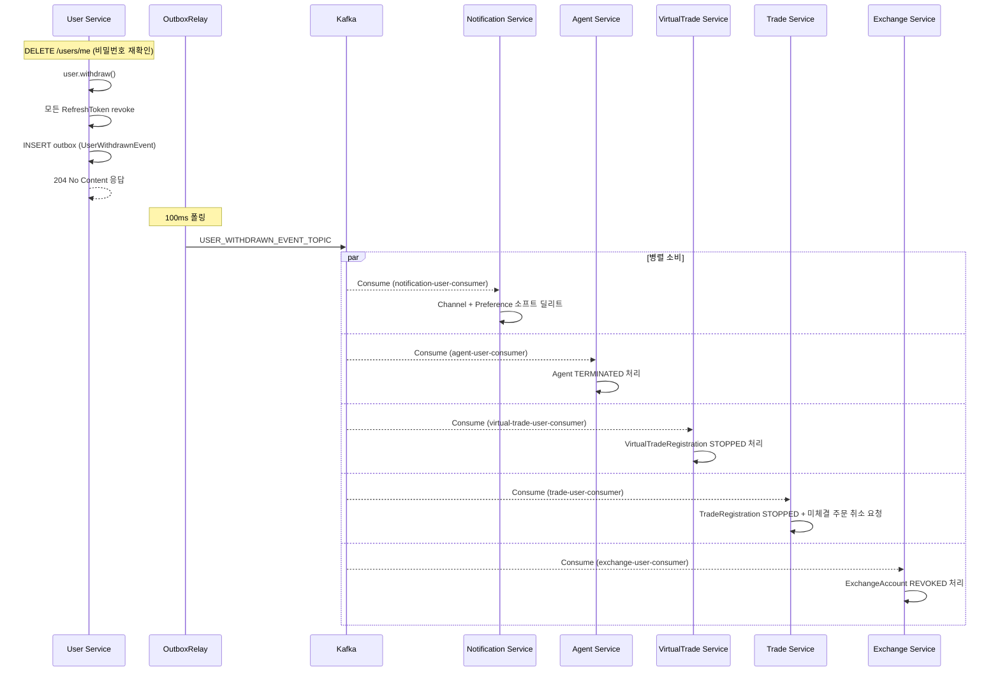

# 이벤트 기반 생명주기 설계

> 사용자 계정 상태 변경 등 도메인 이벤트가 발생했을 때 각 서비스가 수행하는 정리 작업 정의

---

## 1. UserWithdrawnEvent — 회원 탈퇴

### 발행 조건

사용자가 `DELETE /users/me`로 직접 탈퇴하거나 관리자가 계정을 삭제할 때
User Service는 `UserWithdrawnEvent`를 `USER_WITHDRAWN_EVENT_TOPIC`에 발행한다.

**발행 방식**: Outbox 패턴 ([outbox-pattern.md](./outbox-pattern.md) 참조)

**이벤트 페이로드:**
```json
{
  "userIdentifier": "uuid",
  "withdrawnAt": "2024-01-01T00:00:00Z"
}
```

### 서비스별 처리 책임

```
User Service ──▶ USER_WITHDRAWN_EVENT_TOPIC ──▶ Notification Service
                                             ──▶ Agent Service
                                             ──▶ VirtualTrade Service
                                             ──▶ Trade Service
                                             ──▶ Exchange Service
```

| 서비스 | 처리 내용 | 방식 |
|--------|-----------|------|
| **Notification Service** | `NotificationChannel` 소프트 딜리트, `NotificationPreference` 소프트 딜리트 | Soft Delete |
| **Agent Service** | Agent TERMINATED 처리 (Strategy/Portfolio/Signal/Position 감사 목적 보존) | 상태 변경 |
| **VirtualTrade Service** | VirtualTradeRegistration STOPPED 처리 | 상태 변경 |
| **Trade Service** | TradeRegistration STOPPED 처리, 미체결 주문 취소 요청 | 상태 변경 |
| **Exchange Service** | ExchangeAccount REVOKED 처리 (암호화된 API Key 비활성화) | 상태 변경 |

### 설계 원칙

- 각 서비스는 독립적으로 이벤트를 소비하며 처리 순서는 보장하지 않는다 (Eventually Consistent)
- 처리 실패 시 Kafka Consumer retry / DLQ로 재처리
- User Service는 각 서비스의 처리 완료를 기다리지 않는다
- **각 서비스는 멱등성을 보장해야 한다** — 동일 이벤트가 중복 소비되어도 결과가 같아야 함

### 시퀀스 다이어그램



---

### Simulation Service 참고

Simulation Service는 Stateless 오케스트레이션 레이어로 영속 데이터가 없으므로 UserWithdrawnEvent를 별도로 소비하지 않는다.
탈퇴 시점에 백테스팅이 진행 중이면, Agent Service의 Agent가 TERMINATED되면서 gRPC BacktestStrategy 호출이 에러로 반환된다.
Simulation Service는 gRPC 에러를 수신해 SSE 스트림을 종료하는 것으로 충분하다.

---

## 2. 향후 추가 예정 생명주기 이벤트

| 이벤트 | 조건 | 발행 서비스 |
|--------|------|------------|
| `UserSuspendedEvent` | 관리자가 계정 정지 | User Service |
| `StrategyDeactivatedEvent` | 전략 비활성화 | Agent Service |

> 새 생명주기 이벤트 추가 시 이 문서에 항목을 추가하고, 각 Consumer 서비스 설계에 처리 책임을 명시한다.
