# Market Service - 시퀀스 다이어그램

> Market Service의 주요 시나리오별 상호작용 흐름

---

## 1. 심볼 수집 플로우

### 1.1 자동 심볼 수집 (스케줄러)

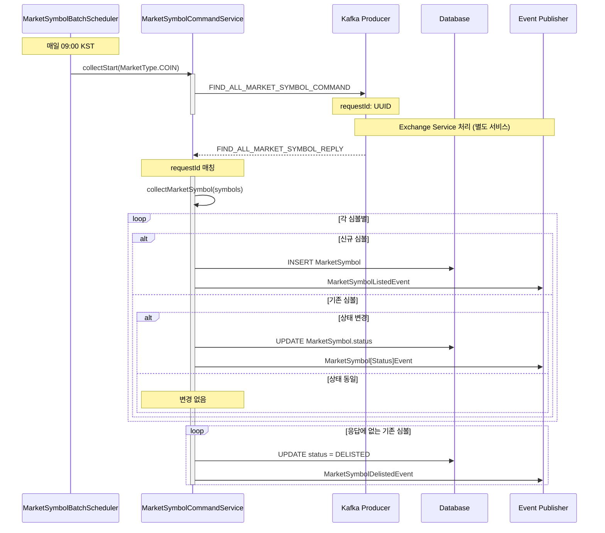
```mermaid
sequenceDiagram
    participant Scheduler as MarketSymbolBatchScheduler
    participant Service as MarketSymbolCommandService
    participant Kafka as Kafka Producer
    participant DB as Database
    participant EventPub as Event Publisher

    Note over Scheduler: 매일 09:00 KST
    Scheduler->>Service: collectStart(MarketType.COIN)

    activate Service
    Service->>Kafka: FIND_ALL_MARKET_SYMBOL_COMMAND
    Note over Kafka: requestId: UUID
    deactivate Service

    Note over Kafka,EventPub: Exchange Service 처리 (별도 서비스)

    Kafka-->>Service: FIND_ALL_MARKET_SYMBOL_REPLY
    Note over Service: requestId 매칭

    activate Service
    Service->>Service: collectMarketSymbol(symbols)

    loop 각 심볼별
        alt 신규 심볼
            Service->>DB: INSERT MarketSymbol
            Service->>EventPub: MarketSymbolListedEvent
        else 기존 심볼
            alt 상태 변경
                Service->>DB: UPDATE MarketSymbol.status
                Service->>EventPub: MarketSymbol[Status]Event
            else 상태 동일
                Note over Service: 변경 없음
            end
        end
    end

    loop 응답에 없는 기존 심볼
        Service->>DB: UPDATE status = DELISTED
        Service->>EventPub: MarketSymbolDelistedEvent
    end

    deactivate Service
```

### 1.2 수동 심볼 수집 (API)

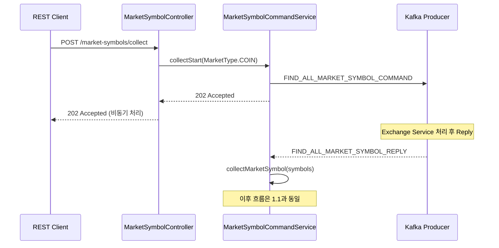
```mermaid
sequenceDiagram
    participant Client as REST Client
    participant Controller as MarketSymbolController
    participant Service as MarketSymbolCommandService
    participant Kafka as Kafka Producer

    Client->>Controller: POST /market-symbols/collect
    Controller->>Service: collectStart(MarketType.COIN)

    Service->>Kafka: FIND_ALL_MARKET_SYMBOL_COMMAND

    Service-->>Controller: 202 Accepted
    Controller-->>Client: 202 Accepted (비동기 처리)

    Note over Kafka: Exchange Service 처리 후 Reply

    Kafka-->>Service: FIND_ALL_MARKET_SYMBOL_REPLY
    Service->>Service: collectMarketSymbol(symbols)
    Note over Service: 이후 흐름은 1.1과 동일
```

---

## 2. 캔들 수집 플로우

### 2.1 MIN_1 캔들 수집 (스케줄러)

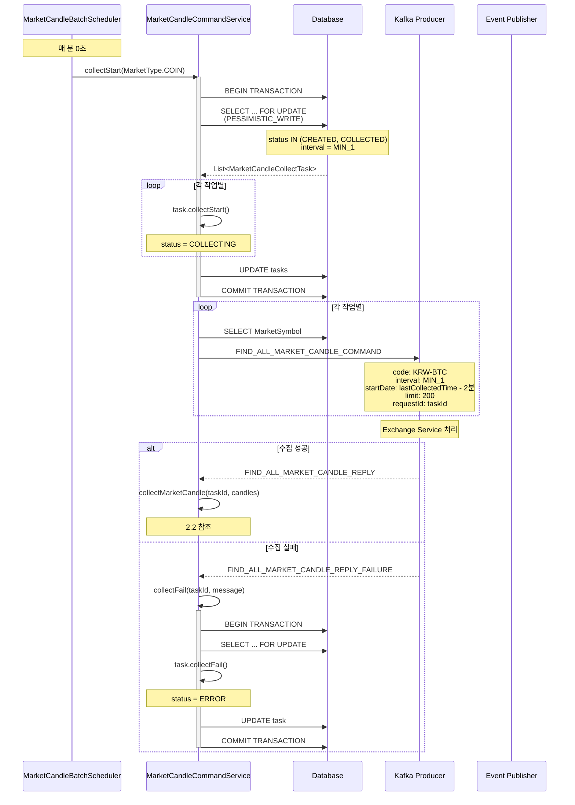
```mermaid
sequenceDiagram
    participant Scheduler as MarketCandleBatchScheduler
    participant Service as MarketCandleCommandService
    participant DB as Database
    participant Kafka as Kafka Producer
    participant EventPub as Event Publisher

    Note over Scheduler: 매 분 0초
    Scheduler->>Service: collectStart(MarketType.COIN)

    activate Service
    Service->>DB: BEGIN TRANSACTION
    Service->>DB: SELECT ... FOR UPDATE<br/>(PESSIMISTIC_WRITE)
    Note over DB: status IN (CREATED, COLLECTED)<br/>interval = MIN_1

    DB-->>Service: List<MarketCandleCollectTask>

    loop 각 작업별
        Service->>Service: task.collectStart()
        Note over Service: status = COLLECTING
    end

    Service->>DB: UPDATE tasks
    Service->>DB: COMMIT TRANSACTION
    deactivate Service

    loop 각 작업별
        Service->>DB: SELECT MarketSymbol
        Service->>Kafka: FIND_ALL_MARKET_CANDLE_COMMAND
        Note over Kafka: code: KRW-BTC<br/>interval: MIN_1<br/>startDate: lastCollectedTime - 2분<br/>limit: 200<br/>requestId: taskId
    end

    Note over Kafka: Exchange Service 처리

    alt 수집 성공
        Kafka-->>Service: FIND_ALL_MARKET_CANDLE_REPLY
        Service->>Service: collectMarketCandle(taskId, candles)
        Note over Service: 2.2 참조
    else 수집 실패
        Kafka-->>Service: FIND_ALL_MARKET_CANDLE_REPLY_FAILURE
        Service->>Service: collectFail(taskId, message)

        activate Service
        Service->>DB: BEGIN TRANSACTION
        Service->>DB: SELECT ... FOR UPDATE
        Service->>Service: task.collectFail()
        Note over Service: status = ERROR
        Service->>DB: UPDATE task
        Service->>DB: COMMIT TRANSACTION
        deactivate Service
    end
```

### 2.2 캔들 수집 완료 처리

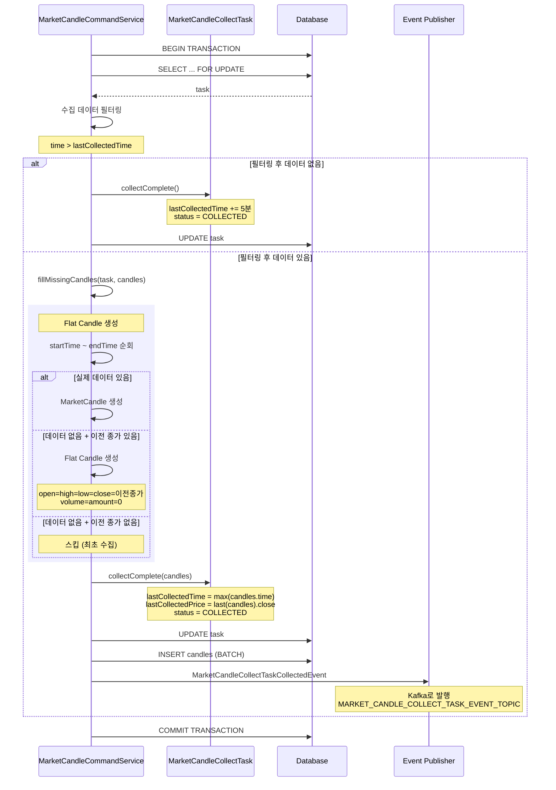
```mermaid
sequenceDiagram
    participant Service as MarketCandleCommandService
    participant Task as MarketCandleCollectTask
    participant DB as Database
    participant EventPub as Event Publisher

    Service->>DB: BEGIN TRANSACTION
    Service->>DB: SELECT ... FOR UPDATE
    DB-->>Service: task

    Service->>Service: 수집 데이터 필터링
    Note over Service: time > lastCollectedTime

    alt 필터링 후 데이터 없음
        Service->>Task: collectComplete()
        Note over Task: lastCollectedTime += 5분<br/>status = COLLECTED
        Service->>DB: UPDATE task
    else 필터링 후 데이터 있음
        Service->>Service: fillMissingCandles(task, candles)

        rect rgb(240, 240, 255)
            Note over Service: Flat Candle 생성
            Service->>Service: startTime ~ endTime 순회

            alt 실제 데이터 있음
                Service->>Service: MarketCandle 생성
            else 데이터 없음 + 이전 종가 있음
                Service->>Service: Flat Candle 생성
                Note over Service: open=high=low=close=이전종가<br/>volume=amount=0
            else 데이터 없음 + 이전 종가 없음
                Note over Service: 스킵 (최초 수집)
            end
        end

        Service->>Task: collectComplete(candles)
        Note over Task: lastCollectedTime = max(candles.time)<br/>lastCollectedPrice = last(candles).close<br/>status = COLLECTED

        Service->>DB: UPDATE task
        Service->>DB: INSERT candles (BATCH)

        Service->>EventPub: MarketCandleCollectTaskCollectedEvent
        Note over EventPub: Kafka로 발행<br/>MARKET_CANDLE_COLLECT_TASK_EVENT_TOPIC
    end

    Service->>DB: COMMIT TRANSACTION
```

---

## 3. 간격 계산 플로우

### 3.1 이벤트 기반 자동 계산

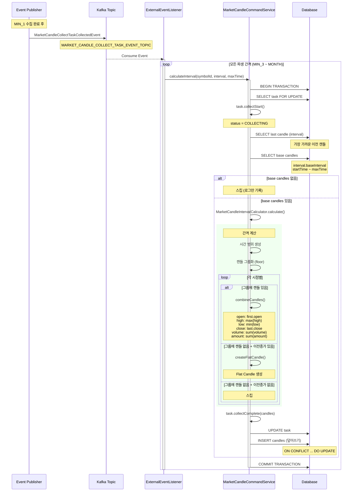
```mermaid
sequenceDiagram
    participant EventPub as Event Publisher
    participant Kafka as Kafka Topic
    participant Listener as ExternalEventListener
    participant Service as MarketCandleCommandService
    participant DB as Database

    Note over EventPub: MIN_1 수집 완료 후
    EventPub->>Kafka: MarketCandleCollectTaskCollectedEvent
    Note over Kafka: MARKET_CANDLE_COLLECT_TASK_EVENT_TOPIC

    Kafka-->>Listener: Consume Event

    activate Listener
    loop 모든 파생 간격 (MIN_3 ~ MONTH)
        Listener->>Service: calculateInterval(symbolId, interval, maxTime)

        activate Service
        Service->>DB: BEGIN TRANSACTION
        Service->>DB: SELECT task FOR UPDATE
        Service->>Service: task.collectStart()
        Note over Service: status = COLLECTING

        Service->>DB: SELECT last candle (interval)
        Note over DB: 가장 가까운 이전 캔들

        Service->>DB: SELECT base candles
        Note over DB: interval.baseInterval<br/>startTime ~ maxTime

        alt base candles 없음
            Note over Service: 스킵 (로그만 기록)
        else base candles 있음
            Service->>Service: MarketCandleIntervalCalculator.calculate()

            rect rgb(240, 255, 240)
                Note over Service: 간격 계산
                Service->>Service: 시간 범위 생성
                Service->>Service: 캔들 그룹화 (floor)

                loop 각 시점별
                    alt 그룹에 캔들 있음
                        Service->>Service: combineCandles()
                        Note over Service: open: first.open<br/>high: max(high)<br/>low: min(low)<br/>close: last.close<br/>volume: sum(volume)<br/>amount: sum(amount)
                    else 그룹에 캔들 없음 + 이전종가 있음
                        Service->>Service: createFlatCandle()
                        Note over Service: Flat Candle 생성
                    else 그룹에 캔들 없음 + 이전종가 없음
                        Note over Service: 스킵
                    end
                end
            end

            Service->>Service: task.collectComplete(candles)
            Service->>DB: UPDATE task
            Service->>DB: INSERT candles (덮어쓰기)
            Note over DB: ON CONFLICT ... DO UPDATE
        end

        Service->>DB: COMMIT TRANSACTION
        deactivate Service
    end
    deactivate Listener
```

---

## 4. 수집 작업 제어 플로우

### 4.1 전체 작업 일시정지/재시작

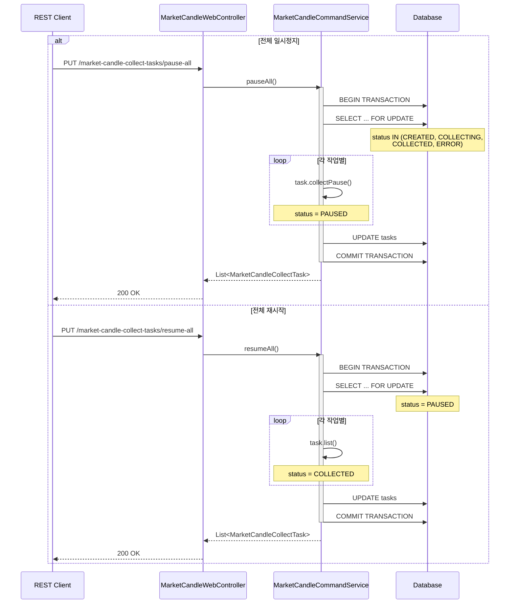
```mermaid
sequenceDiagram
    participant Client as REST Client
    participant Controller as MarketCandleWebController
    participant Service as MarketCandleCommandService
    participant DB as Database

    alt 전체 일시정지
        Client->>Controller: PUT /market-candle-collect-tasks/pause-all
        Controller->>Service: pauseAll()

        activate Service
        Service->>DB: BEGIN TRANSACTION
        Service->>DB: SELECT ... FOR UPDATE
        Note over DB: status IN (CREATED, COLLECTING,<br/>COLLECTED, ERROR)

        loop 각 작업별
            Service->>Service: task.collectPause()
            Note over Service: status = PAUSED
        end

        Service->>DB: UPDATE tasks
        Service->>DB: COMMIT TRANSACTION
        deactivate Service

        Service-->>Controller: List<MarketCandleCollectTask>
        Controller-->>Client: 200 OK
    else 전체 재시작
        Client->>Controller: PUT /market-candle-collect-tasks/resume-all
        Controller->>Service: resumeAll()

        activate Service
        Service->>DB: BEGIN TRANSACTION
        Service->>DB: SELECT ... FOR UPDATE
        Note over DB: status = PAUSED

        loop 각 작업별
            Service->>Service: task.list()
            Note over Service: status = COLLECTED
        end

        Service->>DB: UPDATE tasks
        Service->>DB: COMMIT TRANSACTION
        deactivate Service

        Service-->>Controller: List<MarketCandleCollectTask>
        Controller-->>Client: 200 OK
    end
```

### 4.2 개별 작업 제어

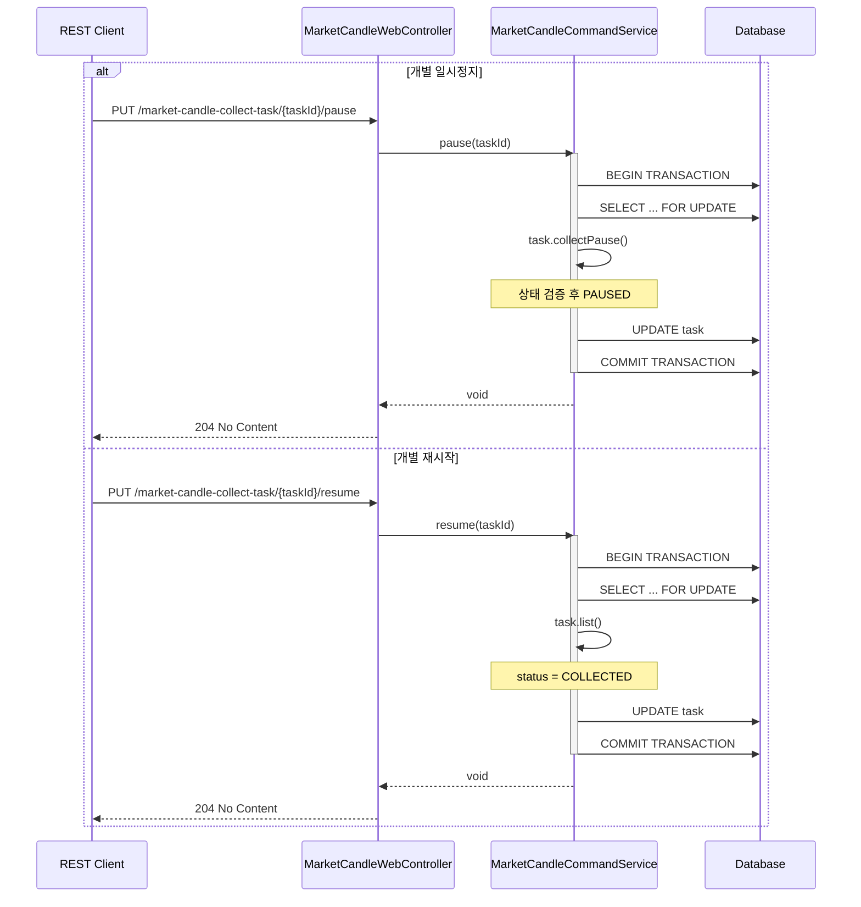
```mermaid
sequenceDiagram
    participant Client as REST Client
    participant Controller as MarketCandleWebController
    participant Service as MarketCandleCommandService
    participant DB as Database

    alt 개별 일시정지
        Client->>Controller: PUT /market-candle-collect-task/{taskId}/pause
        Controller->>Service: pause(taskId)

        activate Service
        Service->>DB: BEGIN TRANSACTION
        Service->>DB: SELECT ... FOR UPDATE
        Service->>Service: task.collectPause()
        Note over Service: 상태 검증 후 PAUSED
        Service->>DB: UPDATE task
        Service->>DB: COMMIT TRANSACTION
        deactivate Service

        Service-->>Controller: void
        Controller-->>Client: 204 No Content
    else 개별 재시작
        Client->>Controller: PUT /market-candle-collect-task/{taskId}/resume
        Controller->>Service: resume(taskId)

        activate Service
        Service->>DB: BEGIN TRANSACTION
        Service->>DB: SELECT ... FOR UPDATE
        Service->>Service: task.list()
        Note over Service: status = COLLECTED
        Service->>DB: UPDATE task
        Service->>DB: COMMIT TRANSACTION
        deactivate Service

        Service-->>Controller: void
        Controller-->>Client: 204 No Content
    end
```

---

## 5. 도메인 이벤트 연동 플로우

### 5.1 심볼 상장 → 수집 작업 생성

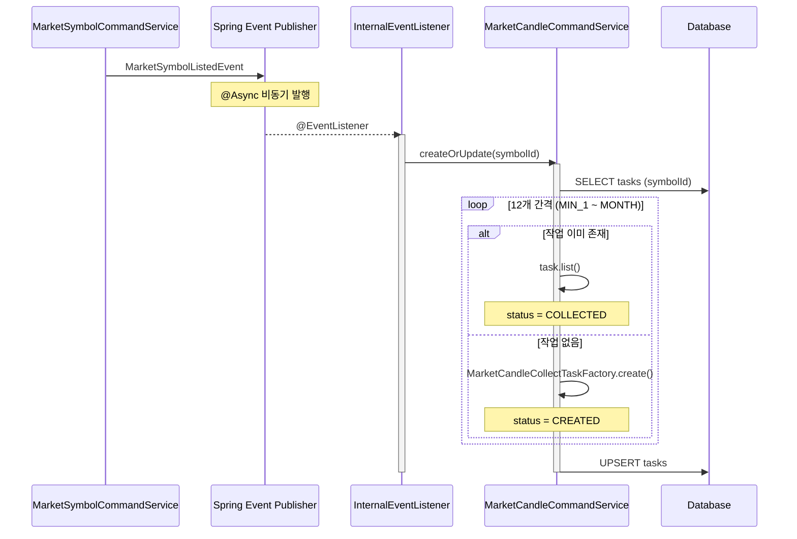
```mermaid
sequenceDiagram
    participant SymbolService as MarketSymbolCommandService
    participant EventPub as Spring Event Publisher
    participant Listener as InternalEventListener
    participant TaskService as MarketCandleCommandService
    participant DB as Database

    SymbolService->>EventPub: MarketSymbolListedEvent
    Note over EventPub: @Async 비동기 발행

    EventPub-->>Listener: @EventListener

    activate Listener
    Listener->>TaskService: createOrUpdate(symbolId)

    activate TaskService
    TaskService->>DB: SELECT tasks (symbolId)

    loop 12개 간격 (MIN_1 ~ MONTH)
        alt 작업 이미 존재
            TaskService->>TaskService: task.list()
            Note over TaskService: status = COLLECTED
        else 작업 없음
            TaskService->>TaskService: MarketCandleCollectTaskFactory.create()
            Note over TaskService: status = CREATED
        end
    end

    TaskService->>DB: UPSERT tasks
    deactivate TaskService
    deactivate Listener
```

### 5.2 심볼 상장폐지 → 수집 작업 중단

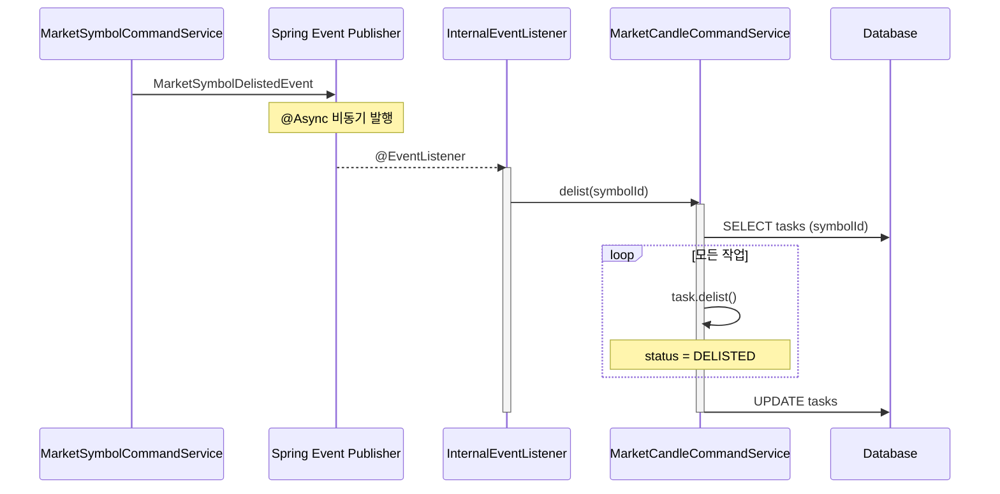
```mermaid
sequenceDiagram
    participant SymbolService as MarketSymbolCommandService
    participant EventPub as Spring Event Publisher
    participant Listener as InternalEventListener
    participant TaskService as MarketCandleCommandService
    participant DB as Database

    SymbolService->>EventPub: MarketSymbolDelistedEvent
    Note over EventPub: @Async 비동기 발행

    EventPub-->>Listener: @EventListener

    activate Listener
    Listener->>TaskService: delist(symbolId)

    activate TaskService
    TaskService->>DB: SELECT tasks (symbolId)

    loop 모든 작업
        TaskService->>TaskService: task.delist()
        Note over TaskService: status = DELISTED
    end

    TaskService->>DB: UPDATE tasks
    deactivate TaskService
    deactivate Listener
```

---

## 6. 파티션 관리 플로우

### 6.1 월별 파티션 자동 생성

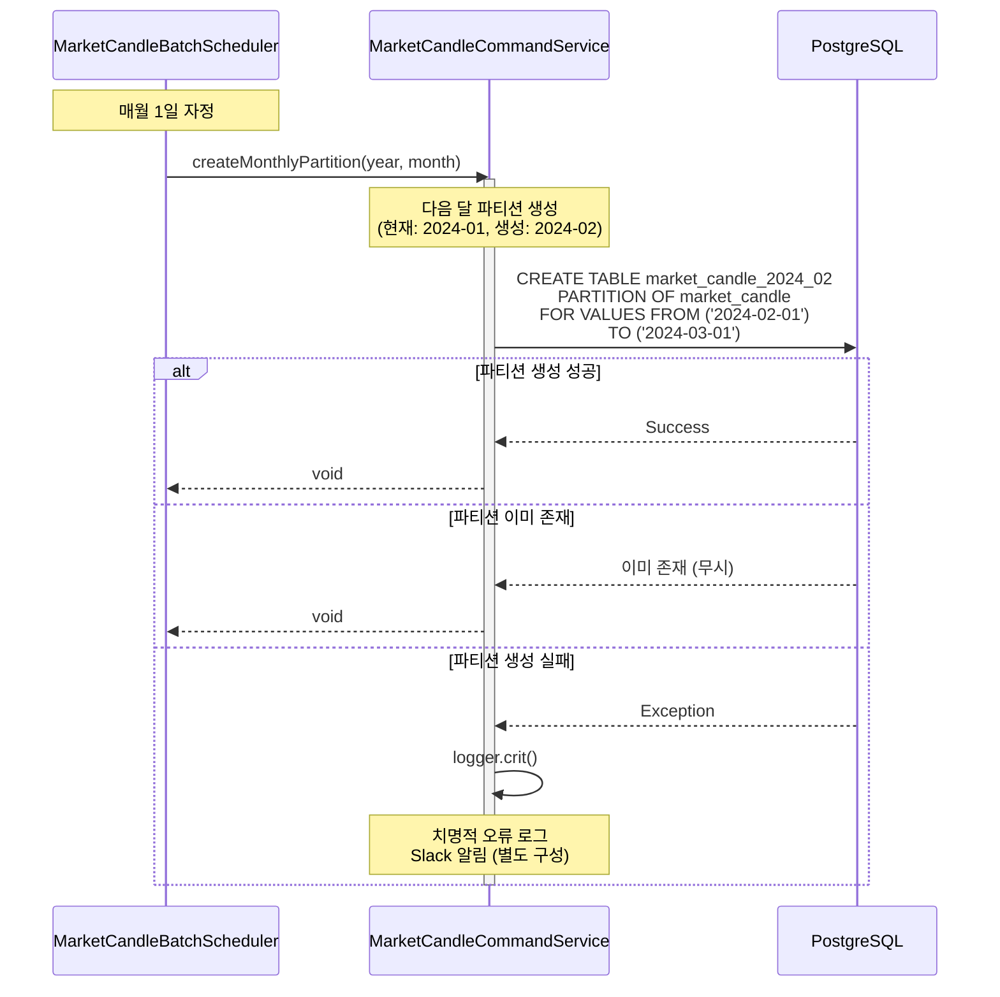
```mermaid
sequenceDiagram
    participant Scheduler as MarketCandleBatchScheduler
    participant Service as MarketCandleCommandService
    participant DB as PostgreSQL

    Note over Scheduler: 매월 1일 자정
    Scheduler->>Service: createMonthlyPartition(year, month)

    activate Service
    Note over Service: 다음 달 파티션 생성<br/>(현재: 2024-01, 생성: 2024-02)

    Service->>DB: CREATE TABLE market_candle_2024_02<br/>PARTITION OF market_candle<br/>FOR VALUES FROM ('2024-02-01')<br/>TO ('2024-03-01')

    alt 파티션 생성 성공
        DB-->>Service: Success
        Service-->>Scheduler: void
    else 파티션 이미 존재
        DB-->>Service: 이미 존재 (무시)
        Service-->>Scheduler: void
    else 파티션 생성 실패
        DB-->>Service: Exception
        Service->>Service: logger.crit()
        Note over Service: 치명적 오류 로그<br/>Slack 알림 (별도 구성)
    end
    deactivate Service
```

---

## 7. 트랜잭션 범위

### 7.1 캔들 수집 트랜잭션

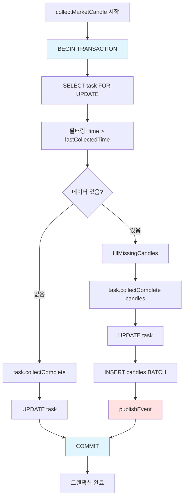
```mermaid
graph TD
    A[collectMarketCandle 시작] --> B[BEGIN TRANSACTION]
    B --> C[SELECT task FOR UPDATE]
    C --> D[필터링: time > lastCollectedTime]
    D --> E{데이터 있음?}

    E -->|없음| F[task.collectComplete]
    F --> G[UPDATE task]
    G --> H[COMMIT]

    E -->|있음| I[fillMissingCandles]
    I --> J[task.collectComplete candles]
    J --> K[UPDATE task]
    K --> L[INSERT candles BATCH]
    L --> M[publishEvent]
    M --> H[COMMIT]

    H --> N[트랜잭션 완료]

    style B fill:#e1f5ff
    style H fill:#e1f5ff
    style M fill:#ffe1e1
```

**트랜잭션 범위**:
- `BEGIN` ~ `COMMIT`: 수집 작업 상태 변경 + 캔들 저장
- **이벤트 발행**: 트랜잭션 커밋 후 (비동기)

### 7.2 수집 시작 트랜잭션

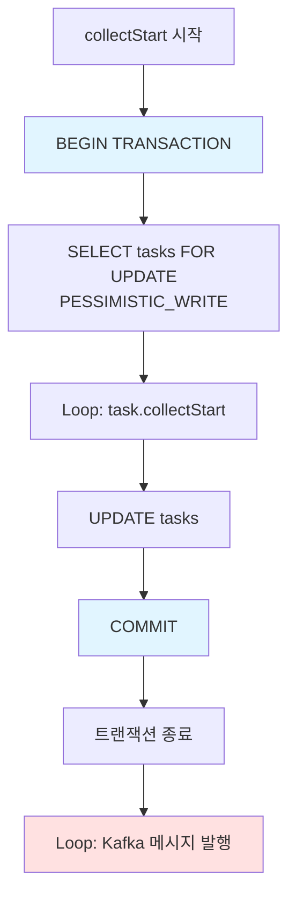
```mermaid
graph TD
    A[collectStart 시작] --> B[BEGIN TRANSACTION]
    B --> C[SELECT tasks FOR UPDATE<br/>PESSIMISTIC_WRITE]
    C --> D[Loop: task.collectStart]
    D --> E[UPDATE tasks]
    E --> F[COMMIT]

    F --> G[트랜잭션 종료]
    G --> H[Loop: Kafka 메시지 발행]

    style B fill:#e1f5ff
    style F fill:#e1f5ff
    style H fill:#ffe1e1
```

**트랜잭션 범위**:
- `BEGIN` ~ `COMMIT`: 수집 작업 상태 변경 (COLLECTING)
- **Kafka 발행**: 트랜잭션 커밋 후

---

## 8. 동시성 제어

### 8.1 PESSIMISTIC_WRITE Lock

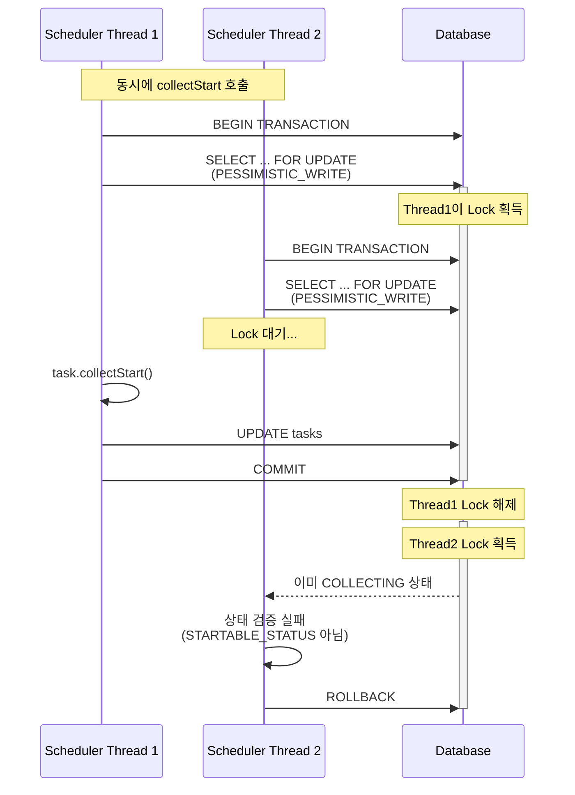
```mermaid
sequenceDiagram
    participant Thread1 as Scheduler Thread 1
    participant Thread2 as Scheduler Thread 2
    participant DB as Database

    Note over Thread1,Thread2: 동시에 collectStart 호출

    Thread1->>DB: BEGIN TRANSACTION
    Thread1->>DB: SELECT ... FOR UPDATE<br/>(PESSIMISTIC_WRITE)

    activate DB
    Note over DB: Thread1이 Lock 획득

    Thread2->>DB: BEGIN TRANSACTION
    Thread2->>DB: SELECT ... FOR UPDATE<br/>(PESSIMISTIC_WRITE)

    Note over Thread2: Lock 대기...

    Thread1->>Thread1: task.collectStart()
    Thread1->>DB: UPDATE tasks
    Thread1->>DB: COMMIT

    deactivate DB
    Note over DB: Thread1 Lock 해제

    activate DB
    Note over DB: Thread2 Lock 획득

    DB-->>Thread2: 이미 COLLECTING 상태
    Thread2->>Thread2: 상태 검증 실패<br/>(STARTABLE_STATUS 아님)
    Thread2->>DB: ROLLBACK
    deactivate DB
```

**Lock 범위**:
- `collectStart()`: 수집 가능한 작업 조회 시
- `collectMarketCandle()`: 특정 작업 업데이트 시
- `collectFail()`: 특정 작업 업데이트 시
- `calculateInterval()`: 간격 계산 시

---

## 9. 에러 처리 플로우

### 9.1 수집 실패 및 자동 재시도

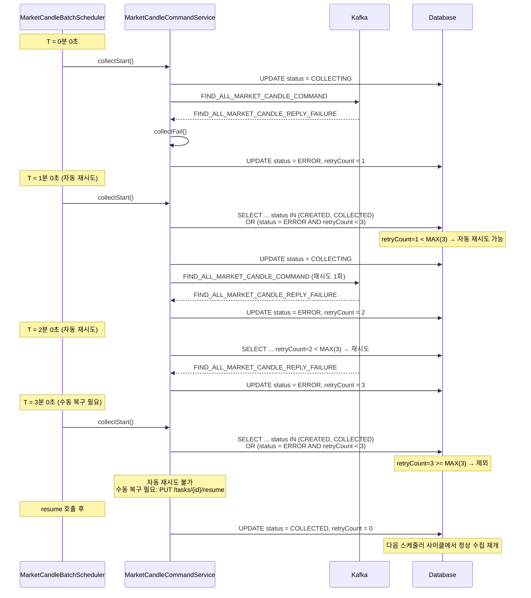
```mermaid
sequenceDiagram
    participant Scheduler as MarketCandleBatchScheduler
    participant Service as MarketCandleCommandService
    participant Kafka as Kafka
    participant DB as Database

    Note over Scheduler: T = 0분 0초
    Scheduler->>Service: collectStart()
    Service->>DB: UPDATE status = COLLECTING
    Service->>Kafka: FIND_ALL_MARKET_CANDLE_COMMAND

    Kafka-->>Service: FIND_ALL_MARKET_CANDLE_REPLY_FAILURE
    Service->>Service: collectFail()
    Service->>DB: UPDATE status = ERROR, retryCount = 1

    Note over Scheduler: T = 1분 0초 (자동 재시도)
    Scheduler->>Service: collectStart()
    Service->>DB: SELECT ... status IN (CREATED, COLLECTED)<br/>OR (status = ERROR AND retryCount < 3)
    Note over DB: retryCount=1 < MAX(3) → 자동 재시도 가능

    Service->>DB: UPDATE status = COLLECTING
    Service->>Kafka: FIND_ALL_MARKET_CANDLE_COMMAND (재시도 1회)

    Kafka-->>Service: FIND_ALL_MARKET_CANDLE_REPLY_FAILURE
    Service->>DB: UPDATE status = ERROR, retryCount = 2

    Note over Scheduler: T = 2분 0초 (자동 재시도)
    Service->>DB: SELECT ... retryCount=2 < MAX(3) → 재시도

    Kafka-->>Service: FIND_ALL_MARKET_CANDLE_REPLY_FAILURE
    Service->>DB: UPDATE status = ERROR, retryCount = 3

    Note over Scheduler: T = 3분 0초 (수동 복구 필요)
    Scheduler->>Service: collectStart()
    Service->>DB: SELECT ... status IN (CREATED, COLLECTED)<br/>OR (status = ERROR AND retryCount < 3)
    Note over DB: retryCount=3 >= MAX(3) → 제외

    Note over Service: 자동 재시도 불가<br/>수동 복구 필요: PUT /tasks/{id}/resume

    Note over Scheduler: resume 호출 후
    Service->>DB: UPDATE status = COLLECTED, retryCount = 0
    Note over DB: 다음 스케줄러 사이클에서 정상 수집 재개
```

### 9.2 Exchange Service 타임아웃

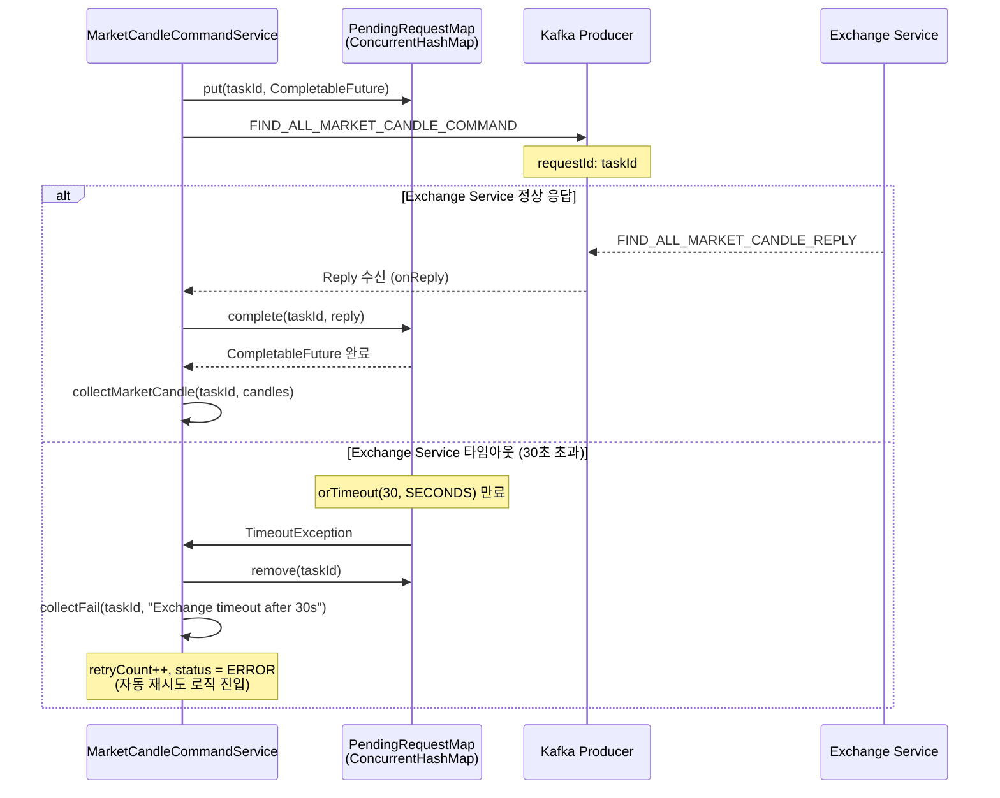
```mermaid
sequenceDiagram
    participant Service as MarketCandleCommandService
    participant PendingMap as PendingRequestMap<br/>(ConcurrentHashMap)
    participant Kafka as Kafka Producer
    participant Exchange as Exchange Service

    Service->>PendingMap: put(taskId, CompletableFuture)
    Service->>Kafka: FIND_ALL_MARKET_CANDLE_COMMAND
    Note over Kafka: requestId: taskId

    alt Exchange Service 정상 응답
        Exchange-->>Kafka: FIND_ALL_MARKET_CANDLE_REPLY
        Kafka-->>Service: Reply 수신 (onReply)
        Service->>PendingMap: complete(taskId, reply)
        PendingMap-->>Service: CompletableFuture 완료
        Service->>Service: collectMarketCandle(taskId, candles)
    else Exchange Service 타임아웃 (30초 초과)
        Note over PendingMap: orTimeout(30, SECONDS) 만료
        PendingMap->>Service: TimeoutException
        Service->>PendingMap: remove(taskId)
        Service->>Service: collectFail(taskId, "Exchange timeout after 30s")
        Note over Service: retryCount++, status = ERROR<br/>(자동 재시도 로직 진입)
    end
```

**구현**:
```kotlin
private val pendingRequests =
    ConcurrentHashMap<MarketCandleCollectTaskId, CompletableFuture<ExchangeReply>>()

fun sendCollectCommand(taskId: MarketCandleCollectTaskId) {
    val future = CompletableFuture<ExchangeReply>()
        .orTimeout(30, TimeUnit.SECONDS)
        .whenComplete { reply, ex ->
            pendingRequests.remove(taskId)
            if (ex is TimeoutException) {
                collectFail(taskId, "Exchange timeout after 30s")
            } else if (ex != null) {
                collectFail(taskId, ex.message ?: "Unknown error")
            }
            // 정상 응답은 onReply()에서 처리
        }
    pendingRequests[taskId] = future
    kafkaProducer.send(FIND_ALL_MARKET_CANDLE_COMMAND, taskId)
}

// Kafka Reply Listener
fun onReply(taskId: MarketCandleCollectTaskId, reply: ExchangeReply) {
    pendingRequests[taskId]?.complete(reply)
}
```

---

## 10. 성능 최적화

### 10.1 배치 삽입

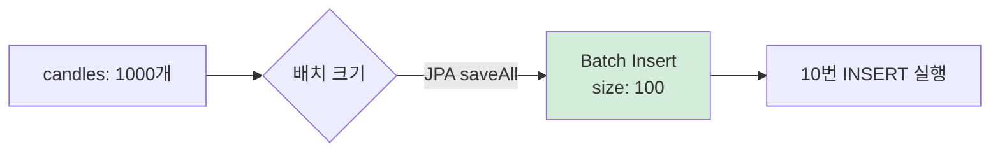
```mermaid
graph LR
    A[candles: 1000개] --> B{배치 크기}
    B -->|JPA saveAll| C[Batch Insert<br/>size: 100]
    C --> D[10번 INSERT 실행]

    style C fill:#d4edda
```

**설정**:
```yaml
spring:
  jpa:
    properties:
      hibernate:
        jdbc:
          batch_size: 100
        order_inserts: true
```

### 10.2 Kafka 동시성

```kotlin
@KafkaListener(
    topic = MARKET_CANDLE_COLLECT_TASK_EVENT_TOPIC,
    groupId = MARKET_CANDLE_CONSUMER_GROUP,
    concurrency = 5,  // 심볼별 파티션 키 기반 병렬 처리
)
```

**이유**: Kafka 파티션 키를 `symbolIdentifier`로 설정하면 동일 심볼 내 메시지 순서가 보장되므로, 심볼 간 병렬 처리가 가능함. 토픽 파티션 수는 concurrency 이상(≥ 5)으로 설정 필요

---

---

## 11. Outbox 패턴

### 11.1 개요

트랜잭션 커밋 후 Kafka 발행 실패 시 Task가 `COLLECTING` 상태에 고착되는 문제를 해결하기 위해 **Transactional Outbox 패턴**을 적용합니다.

**문제**: Task 상태 변경(DB) + Kafka 발행은 원자적으로 처리되지 않아 Kafka 발행 실패 시 상태 불일치 발생
**해결**: Task 상태 변경과 Outbox 레코드 INSERT를 **동일 트랜잭션**으로 묶고, 별도 Relay Processor가 Kafka 발행 보장

**적용 범위**:
- `collectStart()` → `FIND_ALL_MARKET_CANDLE_COMMAND` 발행
- `collectMarketCandle()` → `MarketCandleCollectTaskCollectedEvent` 발행

### 11.2 Outbox 엔티티

```kotlin
class MarketOutboxEvent(
    val id: UUID,                      // 이벤트 ID
    val aggregateType: String,         // 집계 타입 (예: MarketCandleCollectTask)
    val aggregateId: String,           // 집계 ID
    val eventType: String,             // 이벤트 타입 (예: FIND_ALL_MARKET_CANDLE_COMMAND)
    val payload: String,               // JSON 직렬화 페이로드
    var status: OutboxStatus,          // PENDING → PUBLISHED / FAILED
    val createdAt: OffsetDateTime,
    var publishedAt: OffsetDateTime?,
)

enum class OutboxStatus { PENDING, PUBLISHED, FAILED }
```

### 11.3 Outbox 발행 플로우

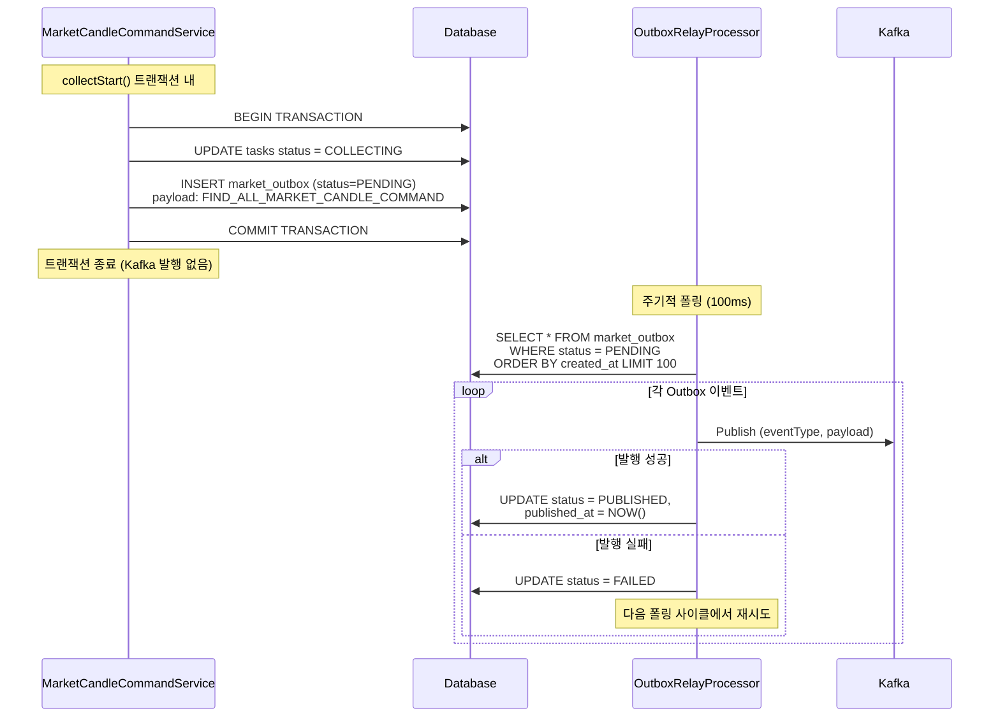
```mermaid
sequenceDiagram
    participant Service as MarketCandleCommandService
    participant DB as Database
    participant Relay as OutboxRelayProcessor
    participant Kafka as Kafka

    Note over Service: collectStart() 트랜잭션 내
    Service->>DB: BEGIN TRANSACTION
    Service->>DB: UPDATE tasks status = COLLECTING
    Service->>DB: INSERT market_outbox (status=PENDING)<br/>payload: FIND_ALL_MARKET_CANDLE_COMMAND
    Service->>DB: COMMIT TRANSACTION
    Note over Service: 트랜잭션 종료 (Kafka 발행 없음)

    Note over Relay: 주기적 폴링 (100ms)
    Relay->>DB: SELECT * FROM market_outbox<br/>WHERE status = PENDING<br/>ORDER BY created_at LIMIT 100

    loop 각 Outbox 이벤트
        Relay->>Kafka: Publish (eventType, payload)
        alt 발행 성공
            Relay->>DB: UPDATE status = PUBLISHED,<br/>published_at = NOW()
        else 발행 실패
            Relay->>DB: UPDATE status = FAILED
            Note over Relay: 다음 폴링 사이클에서 재시도
        end
    end
```

**핵심 원칙**:
- Task 상태 변경 + Outbox INSERT는 **동일 트랜잭션** 내에서 처리 (원자성 보장)
- Kafka 발행 실패 시 `FAILED` 상태로 남아 다음 폴링에서 재시도
- 멱등성 보장: Kafka 메시지에 `taskId`를 포함하여 Consumer에서 중복 처리 방지

---

## 참고

- **트랜잭션**: `@Transactional` 사용
- **비동기**: `@Async` + Virtual Threads
- **Lock**: JPA PESSIMISTIC_WRITE
- **이벤트**: Spring ApplicationEvent + Kafka
- **재시도**: 스케줄러 기반 자동 재시도 (retryCount 기반, MAX_RETRY_COUNT = 3)
- **Outbox**: Transactional Outbox 패턴으로 Kafka 발행 보장
