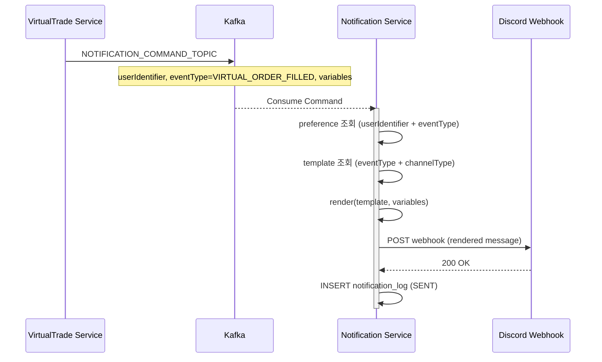

# Notification Service - 도메인 설계

> 알림 채널 관리 및 메시지 발송을 담당하는 Notification Service의 도메인 모델 정의

---

## 1. 서비스 책임

**담당**:
- 사용자별 알림 채널 설정 관리 (Discord Webhook URL 등)
- 알림 수신 여부 설정 (어떤 이벤트를 어느 채널로 받을지)
- `NOTIFICATION_COMMAND_TOPIC` 소비 → 실제 메시지 발송
- 메시지 템플릿 관리 (DB에서 관리, 변수 치환 방식)
- 발송 이력 저장

**담당하지 않음**:
- 사용자 계정/인증 → User Service 담당
- "어떤 이벤트가 발생했는가"의 판단 → 각 발행 서비스 담당

**핵심 설계 원칙 — 의존성 역전**

기존 Notification Service가 다른 도메인의 이벤트 타입을 알아야 했던 구조를 역전한다.
각 서비스(VirtualTrade, Trade, Market 등)가 알림이 필요할 때 `NOTIFICATION_COMMAND_TOPIC`에 발행하며,
Notification Service는 도메인을 알 필요 없이 커맨드를 처리한다.

```
기존 (잘못된 방향):
  Notification Service ← VirtualTrade, Trade, Market 이벤트 타입 enum 의존

개선 (올바른 방향):
  VirtualTrade ──▶ NOTIFICATION_COMMAND_TOPIC ──▶ Notification Service
  Trade        ──▶ NOTIFICATION_COMMAND_TOPIC ──▶ Notification Service
  Market       ──▶ NOTIFICATION_COMMAND_TOPIC ──▶ Notification Service
```

---

## 2. Aggregate Root

### 2.1 NotificationChannel (알림 채널)

**목적**: 사용자가 등록한 알림 발송 채널(Discord 등)을 관리한다.

**속성**:
```kotlin
class NotificationChannel(
    val identifier: NotificationChannelId,  // 고유 식별자 (UUID)
    val userIdentifier: UserId,             // 소유자
    val type: ChannelType,                  // 채널 타입 (DISCORD)
    val config: ChannelConfig,              // 채널 설정 (Sealed class)
    var isActive: Boolean,                  // 활성화 여부
    var isDeleted: Boolean = false,         // 소프트 딜리트
    var deletedAt: OffsetDateTime? = null,
    val createdDate: OffsetDateTime,
    var modifiedDate: OffsetDateTime,
)
```

**ChannelConfig (Sealed class)**:
```kotlin
sealed class ChannelConfig {
    data class DiscordConfig(
        val webhookUrl: String,     // Discord Incoming Webhook URL
    ) : ChannelConfig()
    // 향후 추가: AppPushConfig 등
}
```

**비즈니스 로직**:
```kotlin
fun activate()
fun deactivate()
fun updateConfig(config: ChannelConfig)
fun softDelete()    // isDeleted = true, deletedAt = now
```

**불변 조건 (Invariants)**:
- `userIdentifier`는 변경 불가
- `type`은 변경 불가
- `isDeleted == true`인 채널로는 발송하지 않음
- `isActive == false`인 채널로는 발송하지 않음

---

### 2.2 NotificationPreference (알림 수신 설정)

**목적**: 사용자별로 어떤 이벤트를 어느 채널로 수신할지 설정한다.

**속성**:
```kotlin
class NotificationPreference(
    val identifier: NotificationPreferenceId,
    val userIdentifier: UserId,
    val eventType: String,                              // String 기반 이벤트 타입 (enum 미사용)
    val channelIdentifiers: List<NotificationChannelId>,
    var isEnabled: Boolean,
    var isDeleted: Boolean = false,
    var deletedAt: OffsetDateTime? = null,
    val createdDate: OffsetDateTime,
    var modifiedDate: OffsetDateTime,
)
```

**비즈니스 로직**:
```kotlin
fun enable()
fun disable()
fun updateChannels(channelIdentifiers: List<NotificationChannelId>)
fun softDelete()
```

**불변 조건 (Invariants)**:
- `(userIdentifier, eventType)` 조합은 unique (삭제된 레코드 제외)
- `channelIdentifiers`의 각 채널은 동일 `userIdentifier` 소유여야 함

---

## 3. Entity

### 3.1 NotificationLog (발송 이력)

```kotlin
class NotificationLog(
    val identifier: NotificationLogId,
    val userIdentifier: UserId,
    val channelIdentifier: NotificationChannelId,
    val eventType: String,
    val eventPayload: String,                   // 원본 커맨드 JSON
    val message: String,                        // 실제 발송된 메시지 내용
    var status: NotificationStatus,             // SENT / FAILED
    var failureReason: String?,
    var retryCount: Int = 0,                    // 발송 시도 횟수 (성공=0, 실패=3)
    val createdAt: OffsetDateTime,
    var sentAt: OffsetDateTime?,
)
```

### 3.2 NotificationTemplate (메시지 템플릿)

**목적**: 이벤트 타입별 메시지 형식을 DB에서 관리한다. 코드 변경 없이 템플릿 수정 가능.

```kotlin
class NotificationTemplate(
    val identifier: NotificationTemplateId,
    val eventType: String,                  // 이벤트 타입 (String)
    val channelType: ChannelType,           // 채널 타입별 다른 템플릿 가능
    var titleTemplate: String,              // 제목 템플릿 (변수: ${변수명})
    var bodyTemplate: String,               // 본문 템플릿 (변수: ${변수명})
    var isActive: Boolean = true,
    val createdDate: OffsetDateTime,
    var modifiedDate: OffsetDateTime,
)
```

**템플릿 예시:**
```
eventType: "VIRTUAL_ORDER_FILLED"
channelType: DISCORD
titleTemplate: "[가상거래] 주문 체결"
bodyTemplate:  "${symbol} ${side} ${quantity}개 @ ${price}원"
```

---

## 4. Value Object

### 4.1 NotificationChannelId
```kotlin
@JvmInline
value class NotificationChannelId(val value: UUID) {
    companion object {
        fun of(value: UUID) = NotificationChannelId(value)
        fun generate() = NotificationChannelId(UUID.randomUUID())
    }
}
```

### 4.2 NotificationPreferenceId
```kotlin
@JvmInline
value class NotificationPreferenceId(val value: UUID) {
    companion object {
        fun of(value: UUID) = NotificationPreferenceId(value)
        fun generate() = NotificationPreferenceId(UUID.randomUUID())
    }
}
```

### 4.3 NotificationLogId
```kotlin
@JvmInline
value class NotificationLogId(val value: UUID) {
    companion object {
        fun of(value: UUID) = NotificationLogId(value)
        fun generate() = NotificationLogId(UUID.randomUUID())
    }
}
```

### 4.4 NotificationTemplateId
```kotlin
@JvmInline
value class NotificationTemplateId(val value: UUID) {
    companion object {
        fun of(value: UUID) = NotificationTemplateId(value)
        fun generate() = NotificationTemplateId(UUID.randomUUID())
    }
}
```

---

## 5. Enum

### 5.1 ChannelType (채널 타입)
```kotlin
enum class ChannelType {
    DISCORD,    // Discord Incoming Webhook
    // 향후 추가: APP_PUSH, TELEGRAM 등
}
```

### 5.2 NotificationStatus (발송 상태)
```kotlin
enum class NotificationStatus {
    SENT,   // 발송 성공
    FAILED, // 발송 실패 (3회 재시도 후)
}
```

> **이벤트 타입은 enum이 아닌 String으로 관리한다.**
> Notification Service가 다른 도메인의 이벤트 타입 enum을 알 필요가 없도록 의존성을 역전한다.
> 각 서비스는 자유롭게 이벤트 타입 문자열을 정의하고 `SendNotificationCommand`에 포함한다.

---

## 6. Notification Command

각 서비스가 `NOTIFICATION_COMMAND_TOPIC`에 발행하는 커맨드 구조.

```kotlin
// 각 서비스가 Notification 발행 시 사용하는 커맨드
data class SendNotificationCommand(
    val userIdentifier: UserId,
    val eventType: String,                      // 이벤트 타입 식별자 (자유 문자열)
    val variables: Map<String, String>,         // 템플릿 변수 (모든 값은 String)
)
```

> `variables`는 `Map<String, String>`이지만, **발행 서비스 측에서 타입이 보장된 DTO를 통해 생성**한다.
> Notification Service는 변수를 템플릿에 치환하기만 하므로 String으로 충분하다.

**발행 예시 (VirtualTrade Service 측):**

```kotlin
// VirtualTrade Service가 정의하는 타입화된 변수 빌더
data class OrderFilledNotificationVariables(
    val symbol: String,
    val side: OrderSide,
    val quantity: BigDecimal,
    val price: BigDecimal,
) {
    fun toVariables(): Map<String, String> = mapOf(
        "symbol"   to symbol,
        "side"     to side.name,
        "quantity" to quantity.toPlainString(),
        "price"    to price.toPlainString(),
    )
}

// 발행
val command = SendNotificationCommand(
    userIdentifier = userIdentifier,
    eventType = "VIRTUAL_ORDER_FILLED",
    variables = OrderFilledNotificationVariables(symbol, side, qty, price).toVariables(),
)
kafkaTemplate.send(NOTIFICATION_COMMAND_TOPIC, userIdentifier.value.toString(), command)
```

**주요 이벤트 타입 및 변수 목록:**

| eventType | 발행 서비스 | 주요 variables |
|-----------|-----------|---------------|
| `VIRTUAL_ORDER_FILLED` | VirtualTrade | symbol, side, quantity, price |
| `VIRTUAL_STOP_LOSS` | VirtualTrade | symbol, loss |
| `VIRTUAL_TAKE_PROFIT` | VirtualTrade | symbol, profit |
| `VIRTUAL_DAILY_LOSS_LIMIT` | VirtualTrade | lossAmount, limitAmount |
| `VIRTUAL_DAILY_REPORT` | VirtualTrade | totalPnl, winRate |
| `REAL_ORDER_FILLED` | Trade | symbol, side, quantity, price |
| `REAL_STOP_LOSS` | Trade | symbol, loss |
| `REAL_TAKE_PROFIT` | Trade | symbol, profit |
| `REAL_DAILY_LOSS_LIMIT` | Trade | lossAmount, limitAmount |
| `REAL_WEEKLY_LOSS_LIMIT` | Trade | lossAmount, limitAmount |
| `REAL_MONTHLY_LOSS_LIMIT` | Trade | lossAmount, limitAmount |
| `REAL_DAILY_REPORT` | Trade | totalPnl, winRate |
| `REAL_EMERGENCY_STOP` | Trade | reason |
| `MARKET_COLLECT_ERROR` | Market | symbol, retryCount, errorMessage |
| `MARKET_PARTITION_ERROR` | Market | errorMessage |

> 이벤트 타입 문자열은 각 서비스의 코드에서 상수로 관리한다.
> Notification Service에는 별도 enum이 없으며, 알 수 없는 eventType은 fallback 템플릿으로 처리한다.

---

## 7. Domain Service

### 7.1 NotificationDispatcher

```kotlin
interface NotificationDispatcher {
    fun dispatch(
        userIdentifier: UserId,
        eventType: String,
        variables: Map<String, String>,
    )
}
```

**알고리즘**:
1. `NotificationPreference` 조회 (`userIdentifier` + `eventType`, `isEnabled == true`, `isDeleted == false`)
   - Preference가 없으면 → 발송 스킵
2. 설정된 채널 목록의 `NotificationChannel` 조회 (`isActive == true`, `isDeleted == false`)
3. 채널 타입에 맞는 `NotificationTemplate` 조회 → 변수 치환으로 `NotificationMessage` 생성
4. 채널 타입별 발송 (`DiscordSender`) — **최대 3회 재시도 (1초 간격)**
5. `NotificationLog` 저장 (성공: SENT, retryCount=0 / 실패: FAILED, retryCount=3)

**발송 재시도 정책**:
```kotlin
const val MAX_DISPATCH_RETRY = 3
const val RETRY_DELAY_MS = 1_000L

fun sendWithRetry(channel: NotificationChannel, message: NotificationMessage): Boolean {
    repeat(MAX_DISPATCH_RETRY) { attempt ->
        runCatching { sender.send(channel, message) }
            .onSuccess { return true }
            .onFailure { if (attempt < MAX_DISPATCH_RETRY - 1) Thread.sleep(RETRY_DELAY_MS) }
    }
    return false
}
```

> Outbox 패턴을 적용하지 않는 이유: Notification Service는 Kafka 이벤트를 소비하는 종착점이다.
> 발송 실패 시 DB 상태 불일치가 발생하지 않으며, `NotificationLog`의 FAILED 기록이 감사 역할을 대신한다.

### 7.2 NotificationTemplateRenderer

```kotlin
object NotificationTemplateRenderer {
    fun render(template: NotificationTemplate, variables: Map<String, String>): NotificationMessage {
        var title = template.titleTemplate
        var body  = template.bodyTemplate
        variables.forEach { (key, value) ->
            title = title.replace("\${$key}", value)
            body  = body.replace("\${$key}", value)
        }
        return NotificationMessage(title = title, body = body)
    }
}

data class NotificationMessage(
    val title: String,
    val body: String,
)
```

**Fallback 처리**:
```kotlin
// DB에 템플릿이 없는 eventType → 기본 포맷 사용
fun fallback(eventType: String, variables: Map<String, String>): NotificationMessage =
    NotificationMessage(
        title = "[Trade Pilot] $eventType",
        body  = variables.entries.joinToString(", ") { "${it.key}=${it.value}" },
    )
```

### 7.3 UserWithdrawnEventHandler

```kotlin
// consumeUserEvents(@KafkaListener) → UserWithdrawnEventHandler.handle() 위임
// @KafkaListener는 Section 8의 중앙 리스너에서 일괄 관리
class UserWithdrawnEventHandler(
    private val channelRepository: NotificationChannelRepository,
    private val preferenceRepository: NotificationPreferenceRepository,
) {
    fun handle(event: UserWithdrawnEvent) {
        val userIdentifier = UserId.of(event.userId)
        // 소프트 딜리트 — 감사 목적으로 데이터 보존, 발송 대상에서만 제외
        channelRepository.softDeleteAllByUserId(userIdentifier)
        preferenceRepository.softDeleteAllByUserId(userIdentifier)
        // NotificationLog는 삭제하지 않음 (감사 목적)
    }
}
```

---

## 8. NotificationPreference 초기화 정책

사용자가 명시적으로 opt-in한 이벤트에만 알림을 발송한다 (기본 off).

```kotlin
fun getOrCreate(userIdentifier: UserId, eventType: String): NotificationPreference =
    preferenceRepository.findByUserIdAndEventType(userIdentifier, eventType)
        ?: NotificationPreferenceFactory.create(userIdentifier, eventType)
```

---

## 9. Kafka 이벤트 소비 플로우



---

## 10. Use Case

```kotlin
// 채널 관리
interface CreateNotificationChannelUseCase {
    fun create(userIdentifier: UserId, command: CreateChannelCommand): NotificationChannelId
}

interface UpdateNotificationChannelUseCase {
    fun activate(channelIdentifier: NotificationChannelId, userIdentifier: UserId)
    fun deactivate(channelIdentifier: NotificationChannelId, userIdentifier: UserId)
    fun updateConfig(channelIdentifier: NotificationChannelId, userIdentifier: UserId, config: ChannelConfig)
}

interface DeleteNotificationChannelUseCase {
    fun delete(channelIdentifier: NotificationChannelId, userIdentifier: UserId)   // 소프트 딜리트
}

interface GetNotificationChannelUseCase {
    fun getChannels(userIdentifier: UserId): List<NotificationChannel>
}

// 수신 설정 관리
interface UpdateNotificationPreferenceUseCase {
    fun updatePreference(
        userIdentifier: UserId,
        eventType: String,
        command: UpdatePreferenceCommand,
    )
}

interface GetNotificationPreferenceUseCase {
    fun getPreferences(userIdentifier: UserId): List<NotificationPreferenceResponse>
}

// 발송 이력
interface GetNotificationLogUseCase {
    fun getLogs(userIdentifier: UserId, pageable: Pageable): Page<NotificationLog>
}

// 템플릿 관리 (ADMIN)
interface ManageNotificationTemplateUseCase {
    fun createTemplate(command: CreateTemplateCommand): NotificationTemplateId
    fun updateTemplate(templateIdentifier: NotificationTemplateId, command: UpdateTemplateCommand)
    fun getTemplates(): List<NotificationTemplate>
}
```

---

## 11. API 엔드포인트

```http
# 채널 관리
POST /notification-channels
→ 채널 등록 (Discord)

GET /notification-channels
→ 내 채널 목록 조회 (isDeleted=false 필터)

PUT /notification-channels/{channelIdentifier}/activate
PUT /notification-channels/{channelIdentifier}/deactivate

DELETE /notification-channels/{channelIdentifier}
→ 채널 소프트 딜리트

# 수신 설정
GET /notification-preferences
→ 등록된 수신 설정 목록 조회 (없으면 isEnabled=false 기본값 포함)

PUT /notification-preferences/{eventType}
→ 특정 이벤트 수신 설정 변경
   Body: { isEnabled: true, channelIds: [uuid, uuid] }

# 발송 이력
GET /notification-logs?from=2024-01-01&to=2024-12-31
→ 발송 이력 조회 (페이징)

# 템플릿 관리 (ADMIN)
GET  /notification-templates
POST /notification-templates
PUT  /notification-templates/{templateIdentifier}
```

---

## 12. 데이터베이스 스키마

### notification_channel 테이블
```sql
CREATE TABLE notification_channel (
    identifier      UUID    PRIMARY KEY,
    user_identifier UUID    NOT NULL,
    type            VARCHAR NOT NULL,        -- DISCORD
    config          JSONB   NOT NULL,        -- ChannelConfig JSON
    is_active       BOOLEAN NOT NULL DEFAULT TRUE,
    is_deleted      BOOLEAN NOT NULL DEFAULT FALSE,
    deleted_at      TIMESTAMP WITH TIME ZONE,
    created_date    TIMESTAMP WITH TIME ZONE NOT NULL,
    modified_date   TIMESTAMP WITH TIME ZONE NOT NULL
);

CREATE INDEX notification_channel_user_idx ON notification_channel (user_identifier)
    WHERE is_deleted = FALSE;
```

**config 컬럼 예시**:
```json
{ "webhookUrl": "https://discord.com/api/webhooks/..." }
```

### notification_preference 테이블
```sql
CREATE TABLE notification_preference (
    identifier          UUID    PRIMARY KEY,
    user_identifier     UUID    NOT NULL,
    event_type          VARCHAR NOT NULL,        -- String 이벤트 타입
    channel_identifiers UUID[]  NOT NULL,
    is_enabled          BOOLEAN NOT NULL DEFAULT FALSE,
    is_deleted          BOOLEAN NOT NULL DEFAULT FALSE,
    deleted_at          TIMESTAMP WITH TIME ZONE,
    created_date        TIMESTAMP WITH TIME ZONE NOT NULL,
    modified_date       TIMESTAMP WITH TIME ZONE NOT NULL,

    UNIQUE (user_identifier, event_type)         -- 삭제된 레코드 포함 unique 제약
);

CREATE INDEX notification_preference_user_idx ON notification_preference (user_identifier)
    WHERE is_deleted = FALSE;
```

### notification_log 테이블
```sql
CREATE TABLE notification_log (
    identifier          UUID    PRIMARY KEY,
    user_identifier     UUID    NOT NULL,
    channel_identifier  UUID    NOT NULL,
    event_type          VARCHAR NOT NULL,
    event_payload       TEXT    NOT NULL,
    message             TEXT    NOT NULL,
    status              VARCHAR NOT NULL,    -- SENT, FAILED
    failure_reason      TEXT,
    retry_count         INT     NOT NULL DEFAULT 0,
    created_at          TIMESTAMP WITH TIME ZONE NOT NULL,
    sent_at             TIMESTAMP WITH TIME ZONE
);

CREATE INDEX notification_log_user_idx   ON notification_log (user_identifier);
CREATE INDEX notification_log_time_idx   ON notification_log (created_at);
CREATE INDEX notification_log_failed_idx ON notification_log (created_at)
    WHERE status = 'FAILED';
```

### notification_template 테이블
```sql
CREATE TABLE notification_template (
    identifier      UUID    PRIMARY KEY,
    event_type      VARCHAR NOT NULL,
    channel_type    VARCHAR NOT NULL,       -- DISCORD
    title_template  VARCHAR NOT NULL,
    body_template   TEXT    NOT NULL,
    is_active       BOOLEAN NOT NULL DEFAULT TRUE,
    created_date    TIMESTAMP WITH TIME ZONE NOT NULL,
    modified_date   TIMESTAMP WITH TIME ZONE NOT NULL,

    UNIQUE (event_type, channel_type)       -- 이벤트 타입 + 채널 타입 조합 unique
);

CREATE INDEX notification_template_event_idx ON notification_template (event_type, channel_type)
    WHERE is_active = TRUE;
```

### processed_events 테이블

```sql
CREATE TABLE processed_events (
    topic       VARCHAR(255) NOT NULL,
    partition   INT          NOT NULL,
    offset      BIGINT       NOT NULL,
    consumed_at TIMESTAMPTZ  NOT NULL DEFAULT NOW(),
    PRIMARY KEY (topic, partition, offset)
);
```

> `processed_events` 테이블은 Kafka Consumer의 멱등성 보장을 위해 사용된다.
> 동일 이벤트의 중복 소비를 방지하기 위해 처리된 (topic, partition, offset) 조합을 기록한다.

---

## 13. 예외

```kotlin
enum class NotificationErrorCode(
    override val code: String,
    override val message: String,
) : ErrorCode {
    CHANNEL_NOT_FOUND("N001", "Notification channel not found"),
    CHANNEL_NOT_OWNED("N002", "Notification channel not owned by user"),
    CHANNEL_ALREADY_INACTIVE("N003", "Channel is already inactive"),
    PREFERENCE_NOT_FOUND("N004", "Notification preference not found"),
    DISPATCH_FAILED("N005", "Notification dispatch failed"),
    TEMPLATE_NOT_FOUND("N006", "Notification template not found"),
}
```

---

## 14. 도메인 관계

```
User (UserId 참조)
  │
  ├─< (N) NotificationChannel       (채널 설정, 소프트 딜리트)
  │
  ├─< (N) NotificationPreference    (이벤트별 수신 설정, 소프트 딜리트)
  │          └── channelIdentifiers → NotificationChannel 참조
  │
  └─< (N) NotificationLog           (발송 이력, 영구 보존)

NotificationTemplate                 (eventType + channelType → 템플릿)
```

**생명주기**:
1. 사용자가 `NotificationChannel` 등록 (Discord Webhook URL)
2. `NotificationPreference`에서 원하는 이벤트 + 채널 연결 (opt-in)
3. 다른 서비스가 `NOTIFICATION_COMMAND_TOPIC`에 `SendNotificationCommand` 발행
4. `NotificationDispatcher`가 채널 설정 + 템플릿 조회 후 발송
5. `NotificationLog`에 결과 기록
6. 회원 탈퇴 시 Channel + Preference 소프트 딜리트, Log는 영구 보존
