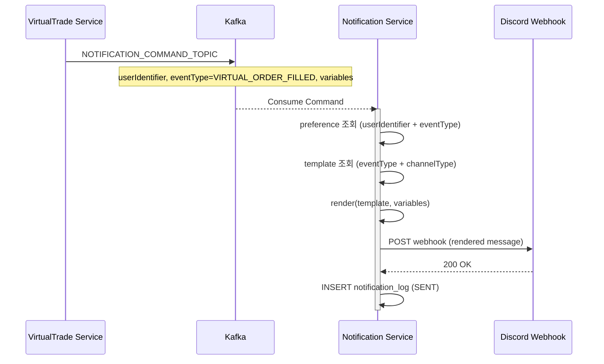

# Notification Service — Kafka 이벤트 소비

> 이 문서는 `backend/notification/domain.md`에서 분할되었습니다.

---

## 9. Kafka 이벤트 소비 플로우

```mermaid
sequenceDiagram
    participant VT as VirtualTrade Service
    participant Kafka as Kafka
    participant NS as Notification Service
    participant Discord as Discord Webhook

    VT->>Kafka: NOTIFICATION_COMMAND_TOPIC
    Note over Kafka: userIdentifier, eventType=VIRTUAL_ORDER_FILLED, variables

    Kafka-->>NS: Consume Command

    activate NS
    NS->>NS: preference 조회 (userIdentifier + eventType)

    NS->>NS: template 조회 (eventType + channelType)
    NS->>NS: render(template, variables)

    NS->>Discord: POST webhook (rendered message)
    Discord-->>NS: 200 OK
    NS->>NS: INSERT notification_log (SENT)
    deactivate NS
```
