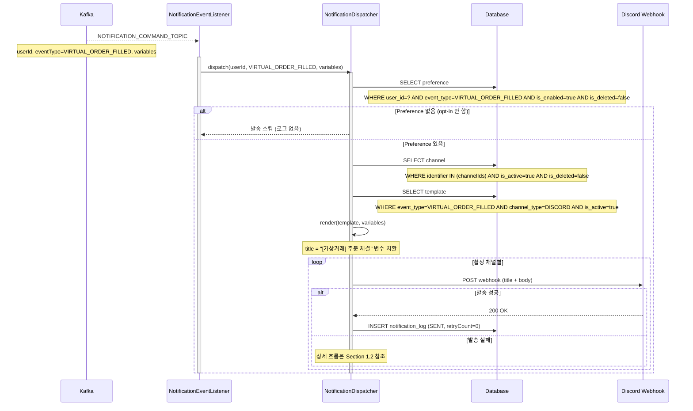
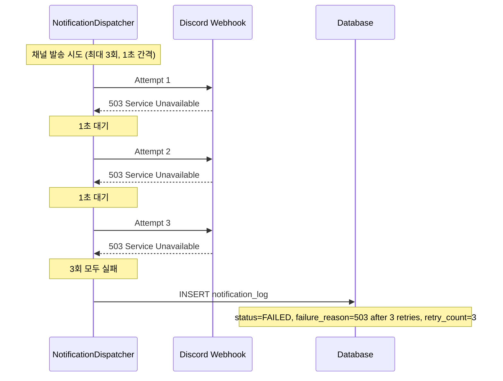
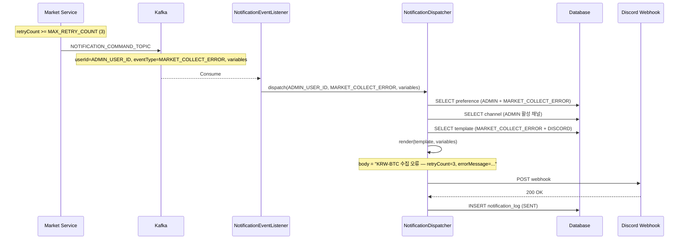
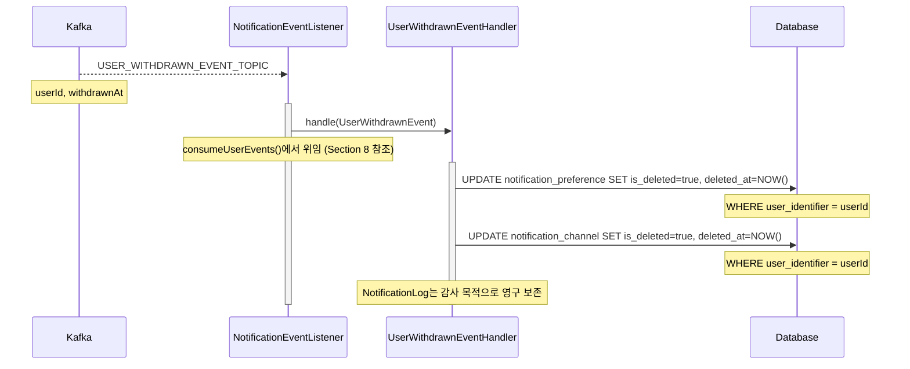
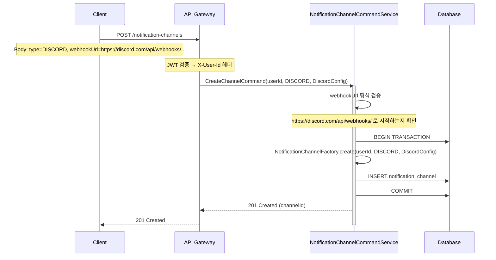
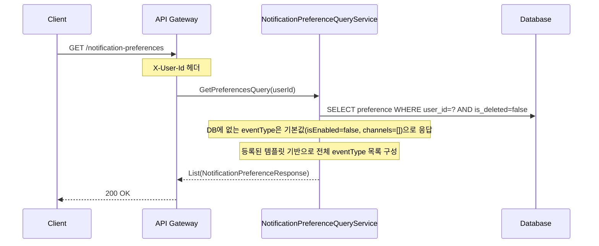
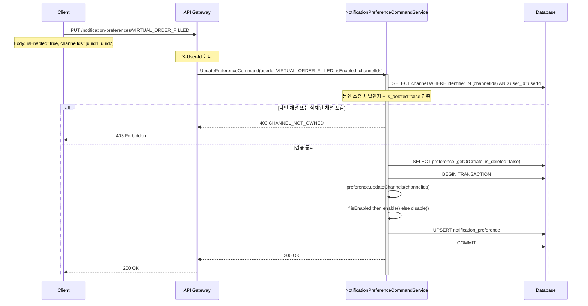
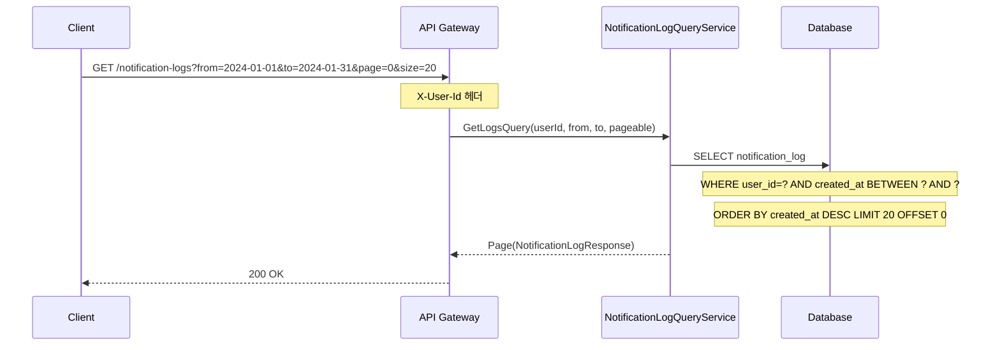
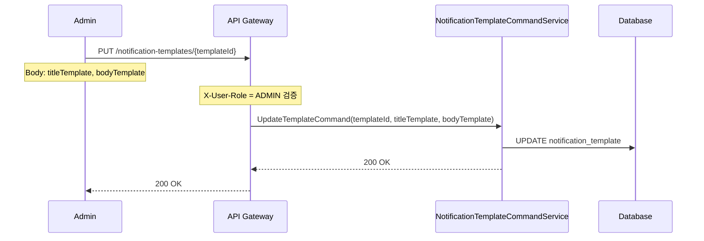

# Notification Service - 시퀀스 다이어그램

> Notification Service의 주요 시나리오별 상호작용 흐름

---

## 1. Kafka 이벤트 소비 및 발송 (메인 플로우)

### 1.1 정상 발송



### 1.2 발송 실패 재시도



> 발송 실패는 Kafka 메시지를 재큐잉하지 않는다. Notification은 종착점이므로
> 재시도는 인라인(동기)으로 처리하고 결과를 `notification_log`에 기록한다.

---

## 2. Market 오류 알림

Market Service에서 수집 오류 또는 파티션 실패 발생 시 `NOTIFICATION_COMMAND_TOPIC`에 발행한다.
Market 오류는 시스템 관리자(`ADMIN_USER_ID`)에게 발송한다.



---

## 3. 회원 탈퇴 이벤트 처리



---

## 4. 채널 등록 플로우



---

## 5. 수신 설정 변경 플로우

### 5.1 이벤트 타입별 설정 조회



### 5.2 수신 설정 변경 (opt-in / opt-out)



---

## 6. 발송 이력 조회



---

## 7. 템플릿 관리 (ADMIN)



> 코드 배포 없이 메시지 형식을 수정할 수 있다.
> 새 이벤트 타입 추가 시: DB에 템플릿 레코드 INSERT만 하면 된다.

---

## 8. 트랜잭션 범위

| 작업 | 트랜잭션 범위 | 외부 I/O |
|------|--------------|----------|
| 채널 등록 | INSERT channel | 없음 |
| 수신 설정 변경 | UPSERT preference | 없음 |
| 이벤트 발송 | INSERT notification_log | Discord Webhook (트랜잭션 외부) |
| 회원 탈퇴 처리 | UPDATE preference(soft) + UPDATE channel(soft) | 없음 |
| 템플릿 수정 | UPDATE template | 없음 |

> 발송(Discord) 후 DB 기록 실패 시: 발송은 됐지만 로그가 없는 상태가 된다.
> 이는 허용 가능한 불일치다 (반대 방향보다 덜 위험).

---

## 9. Kafka Consumer 설정

```kotlin
// 단일 NOTIFICATION_COMMAND_TOPIC에서 모든 알림 커맨드 소비
@KafkaListener(
    topics = [NOTIFICATION_COMMAND_TOPIC],
    groupId = "notification-command-consumer",
    concurrency = 5,   // userId 파티션 키 → 동일 사용자 순서 보장
)
fun consumeNotificationCommands(record: ConsumerRecord<String, String>) {
    val command = objectMapper.readValue(record.value(), SendNotificationCommand::class.java)
    notificationDispatcher.dispatch(command.userId, command.eventType, command.variables)
}

// 회원 탈퇴 이벤트 (도메인 이벤트, 별도 그룹)
@KafkaListener(
    topics = [USER_WITHDRAWN_EVENT_TOPIC],
    groupId = "notification-user-consumer",
    concurrency = 3,
)
fun consumeUserEvents(record: ConsumerRecord<String, String>) {
    val event = objectMapper.readValue(record.value(), UserWithdrawnEvent::class.java)
    userWithdrawnEventHandler.handle(event)
}
```

> 파티션 키 = `userId`이므로 동일 사용자의 이벤트는 순서가 보장되며 동시에 처리되지 않는다.

---

## 참고

- **발송 채널**: Discord Webhook (향후 앱 푸시 등으로 확장)
- **발송 재시도**: 인라인 3회 (1초 간격), Outbox 패턴 미적용
- **이벤트 타입**: String 기반, Notification Service에 enum 없음
- **메시지 템플릿**: DB 관리, ADMIN API로 수정 가능
- **opt-in 정책**: Preference 레코드가 없으면 발송 스킵
- **Market 오류**: ADMIN 역할 사용자에게만 발송
- **회원 탈퇴**: channel + preference 소프트 딜리트, log는 영구 보존
