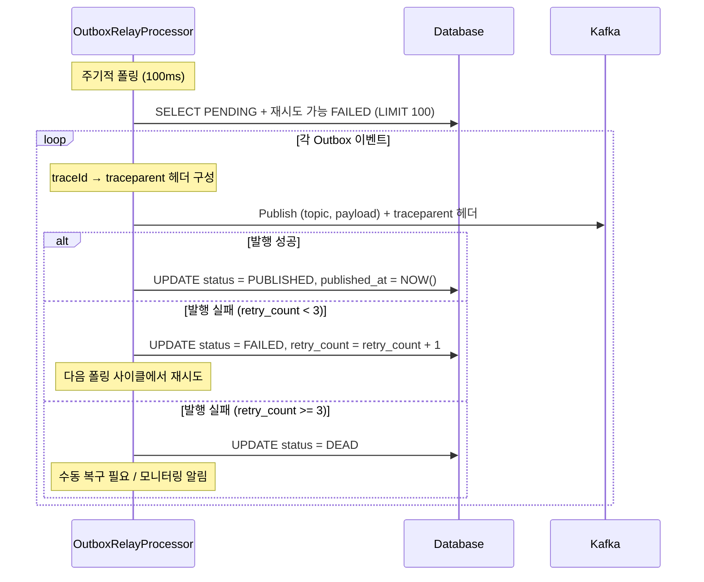

# Transactional Outbox 패턴

> MSA 환경에서 DB 상태 변경과 Kafka 메시지 발행의 원자성을 보장하기 위한 글로벌 설계 표준

---

## 1. 문제: DB + Kafka 원자성 보장 불가

서비스 내부 상태 변경(DB)과 외부 이벤트 발행(Kafka)은 하나의 트랜잭션으로 묶을 수 없다.
트랜잭션 커밋 후 Kafka 발행 전에 장애가 발생하면 **이벤트 유실**이 발생한다.

```
[문제 시나리오]
Service → DB COMMIT (상태 변경 성공)
       → Kafka 발행 ← 여기서 장애 발생 → 이벤트 유실
```

추가로 Outbox Relay는 별도 스케줄러 스레드에서 실행되므로, 원본 HTTP 요청의
MDC 컨텍스트(traceId)가 소멸된 후 Kafka를 발행하게 된다 → **traceId 유실**.

---

## 2. 해결: Transactional Outbox

DB 상태 변경과 Outbox 레코드 INSERT를 **동일 트랜잭션**으로 묶고,
별도 Relay Processor가 Outbox를 폴링하여 Kafka 발행을 보장한다.
INSERT 시점에 traceId / parentSpanId를 컬럼에 저장하여 분산 트레이싱을 복원한다.

```
[정상 흐름]
Service → BEGIN TRANSACTION
        → UPDATE 상태
        → INSERT outbox (payload + traceId)
        → COMMIT

Relay   → SELECT outbox WHERE status = PENDING (또는 재시도 가능 FAILED)
        → Kafka 발행 (traceparent 헤더 포함)
        → UPDATE outbox status = PUBLISHED
```

---

## 3. 공통 OutboxEvent 엔티티 템플릿

각 서비스는 아래 구조를 기반으로 Outbox 엔티티를 정의한다.

> 각 서비스는 물리적으로 분리된 DB 인스턴스를 사용하므로 테이블명은 `outbox`로 통일한다.
> (네임스페이스 충돌 없음)

```kotlin
class OutboxEvent(
    val id: UUID,
    val aggregateType: String,         // 예: MarketCandleCollectTask
    val aggregateId: String,           // Aggregate UUID
    val eventType: String,             // 예: FIND_ALL_MARKET_CANDLE_COMMAND
    val payload: String,               // JSON 직렬화 페이로드
    val traceId: String?,              // 원본 요청 traceId (MDC에서 캡처)
    val parentSpanId: String?,         // 원본 요청 spanId (MDC에서 캡처)
    var status: OutboxStatus,          // PENDING → PUBLISHED / FAILED / DEAD
    var retryCount: Int = 0,           // Kafka 발행 실패 횟수 (MAX: 3)
    val createdAt: OffsetDateTime,
    var publishedAt: OffsetDateTime?,
)

enum class OutboxStatus {
    PENDING,     // 발행 대기
    PUBLISHED,   // 발행 성공
    FAILED,      // 발행 실패 (재시도 가능, retryCount < MAX_OUTBOX_RETRY_COUNT)
    DEAD,        // 재시도 한도 초과 → 수동 복구 필요
}

const val MAX_OUTBOX_RETRY_COUNT = 3
```

---

## 4. INSERT 시점 — traceId 캡처

원본 요청 스레드 MDC가 살아있는 트랜잭션 내에서 traceId를 캡처한다.
Relay 스레드에는 MDC 컨텍스트가 없으므로 반드시 이 시점에 저장해야 한다.

```kotlin
val span = tracer.currentSpan()

OutboxEvent(
    id = UUID.randomUUID(),
    aggregateType = "...",
    aggregateId = aggregate.identifier.value.toString(),
    eventType = "...",
    payload = objectMapper.writeValueAsString(commandPayload),
    traceId = span?.context()?.traceId(),       // MDC에서 캡처
    parentSpanId = span?.context()?.spanId(),   // MDC에서 캡처
    status = OutboxStatus.PENDING,
    retryCount = 0,
    createdAt = OffsetDateTime.now(),
    publishedAt = null,
)
```

---

## 5. Relay Processor 설계

### 5.1 폴링 주기 및 배치 크기

- 폴링 주기: 100ms
- 배치 크기: 100건 (한 사이클에 최대 100개 처리)

### 5.2 폴링 쿼리

```sql
SELECT * FROM outbox
WHERE (status = 'PENDING')
   OR (status = 'FAILED' AND retry_count < 3)
ORDER BY created_at
LIMIT 100
```

### 5.3 발행 흐름



### 5.4 Kafka 헤더 — traceId 복원

W3C TraceContext 형식으로 `traceparent` 헤더를 구성하여
Kafka Consumer가 동일 traceId로 분산 트레이싱을 이어받는다.

```kotlin
fun publishOutboxEvent(event: OutboxEvent, topic: String, partitionKey: String) {
    val record = ProducerRecord<String, String>(topic, partitionKey, event.payload)

    event.traceId?.let {
        val newSpanId = generateSpanId()
        record.headers().add(
            "traceparent",
            "00-${it}-${newSpanId}-01".toByteArray()
        )
        event.parentSpanId?.let { parentId ->
            record.headers().add(
                "tracestate",
                "parentSpanId=${parentId}".toByteArray()
            )
        }
    }

    kafkaTemplate.send(record)
}
```

---

## 6. DB 스키마

각 서비스는 물리적으로 분리된 DB 인스턴스를 사용하므로 테이블명을 `outbox`로 통일한다.

```sql
CREATE TABLE outbox (
    id               UUID    PRIMARY KEY,
    aggregate_type   VARCHAR NOT NULL,                    -- Aggregate 타입
    aggregate_id     VARCHAR NOT NULL,                    -- Aggregate UUID
    event_type       VARCHAR NOT NULL,                    -- 이벤트/커맨드 타입
    payload          TEXT    NOT NULL,                    -- JSON 직렬화 페이로드
    trace_id         VARCHAR,                            -- 원본 traceId (W3C: 32자 hex)
    parent_span_id   VARCHAR,                            -- 원본 spanId  (W3C: 16자 hex)
    status           VARCHAR NOT NULL DEFAULT 'PENDING', -- PENDING | PUBLISHED | FAILED | DEAD
    retry_count      INT     NOT NULL DEFAULT 0,         -- Kafka 발행 실패 횟수 (MAX: 3)
    created_at       TIMESTAMP WITH TIME ZONE NOT NULL,
    published_at     TIMESTAMP WITH TIME ZONE
);

-- Relay 폴링용: PENDING + 재시도 가능 FAILED
CREATE INDEX outbox_relay_idx ON outbox (created_at)
    WHERE status IN ('PENDING', 'FAILED');

-- DEAD 모니터링용
CREATE INDEX outbox_dead_idx ON outbox (created_at)
    WHERE status = 'DEAD';
```

---

## 7. TraceId 전파 결과

Outbox 패턴 적용 후 분산 트레이싱이 끊기지 않고 이어진다.

```
HTTP 요청 (traceId: abc-123, spanId: span-1)
  └─ 비즈니스 로직 실행        (abc-123 / span-2)
       └─ Outbox INSERT       (traceId: abc-123 컬럼 저장)

[비동기 갭 — Relay 스케줄러 스레드]

  └─ Relay Kafka 발행         (abc-123 / span-3)  ← 동일 traceId 복원
       └─ Kafka Consumer      (abc-123 / span-4)  ← Micrometer 자동 복원
            └─ 다음 서비스     (abc-123 / span-5)
```

Jaeger / Zipkin에서 원본 HTTP 요청부터 Kafka Consumer까지
**하나의 트레이스**로 조회 가능하다.

| 구간 | 전파 방식 |
|------|-----------|
| HTTP 요청 → 서비스 | Spring Micrometer 자동 전파 |
| 서비스 → Outbox INSERT | 수동으로 traceId 컬럼 저장 |
| Outbox Relay → Kafka | 수동으로 `traceparent` 헤더 구성 |
| Kafka Consumer → 서비스 | Micrometer + Kafka 자동 복원 |

---

## 8. 서비스별 적용 규칙

### 8.1 Outbox 적용 대상 판단 기준

아래 조건을 **모두** 만족하면 Outbox 패턴을 적용한다.

- DB 상태 변경과 Kafka 발행이 동시에 발생하는 경우
- 발행 실패 시 상태 불일치가 복구 불가능한 결과를 초래하는 경우

### 8.2 서비스별 적용 범위

| 서비스 | 적용 Kafka 발행 |
|--------|-----------------|
| User Service | `withdraw()` → `UserWithdrawnEvent` 발행 |
| Market Service | `collectStart()` → COMMAND 발행, `collectComplete()` → EVENT 발행 |
| Trade Service | 실주문 실행 커맨드, 체결 이벤트 발행 |
| VirtualTrade Service | 가상 주문 체결 이벤트, 리스크 알림 이벤트 발행 |

### 8.3 멱등성 보장 — `processed_events` 테이블

FAILED → 재시도 시 Kafka에 동일 메시지가 중복 발행될 수 있다.
Consumer는 Kafka `(topic, partition, offset)` 조합으로 중복 처리를 방지한다.

**DB 스키마 (각 Consumer 서비스):**

```sql
CREATE TABLE processed_events (
    topic       VARCHAR NOT NULL,
    partition   INT     NOT NULL,
    "offset"    BIGINT  NOT NULL,
    consumed_at TIMESTAMP WITH TIME ZONE NOT NULL DEFAULT NOW(),

    PRIMARY KEY (topic, partition, "offset")
);
```

**Consumer 처리 패턴:**

```kotlin
@KafkaListener(...)
fun onEvent(record: ConsumerRecord<String, String>) {
    val key = ProcessedEventKey(record.topic(), record.partition(), record.offset())

    // 이미 처리한 메시지면 skip
    if (processedEventRepository.existsById(key)) return

    // 비즈니스 처리 + 멱등성 레코드 INSERT (동일 트랜잭션)
    transactionTemplate.execute {
        processedEventRepository.save(ProcessedEvent(key))
        handleEvent(record)
    }
}
```

> `processed_events`는 일정 기간(예: 7일) 이후 오래된 레코드를 배치 삭제하여 테이블 크기를 관리한다.

---

## 참고

- **트랜잭션**: `@Transactional`으로 DB 변경 + Outbox INSERT 원자성 보장
- **Relay 실행**: `@Scheduled` + Virtual Threads
- **분산 트레이싱**: Micrometer Tracing (W3C TraceContext)
- **DEAD 레코드 알림**: Grafana 알림 또는 Discord Webhook 연동 권장
