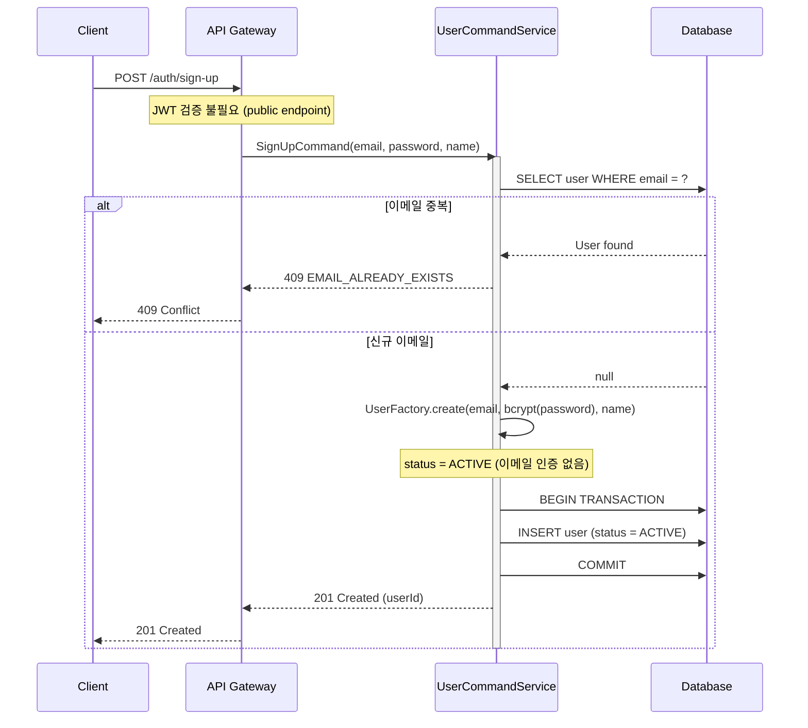
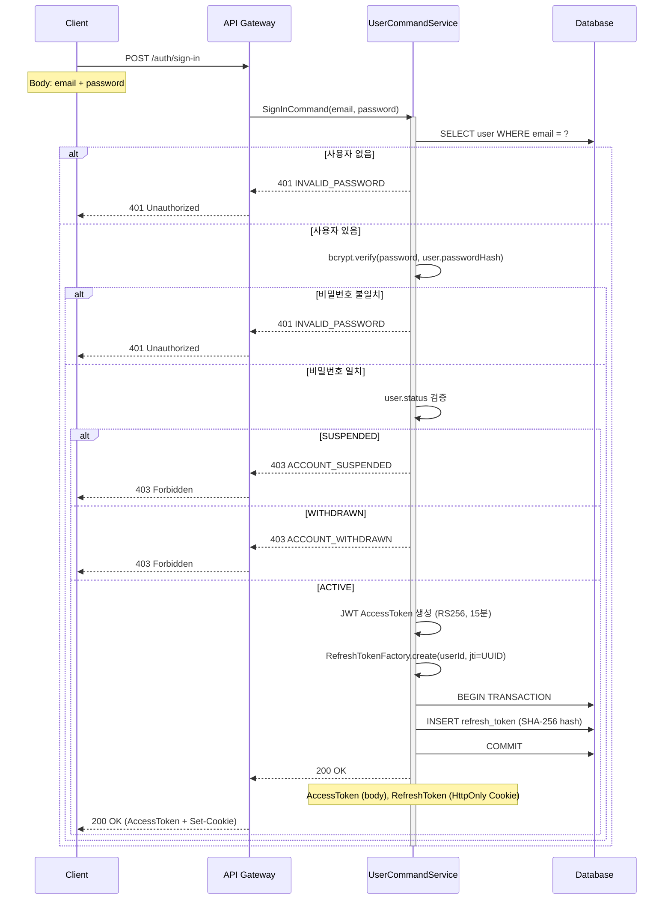
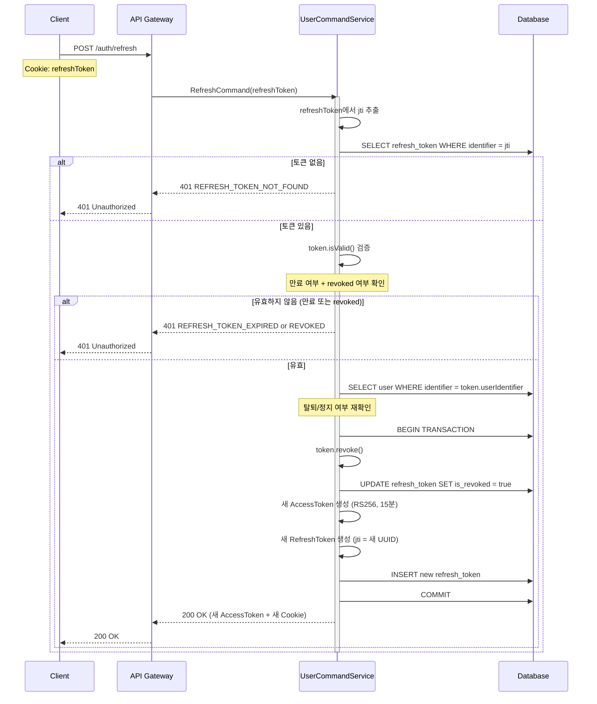
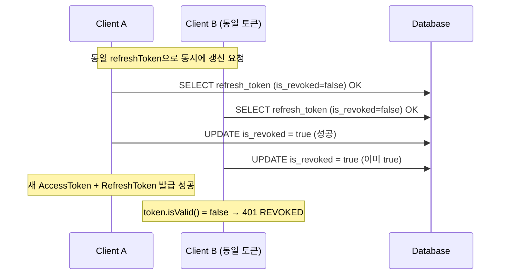
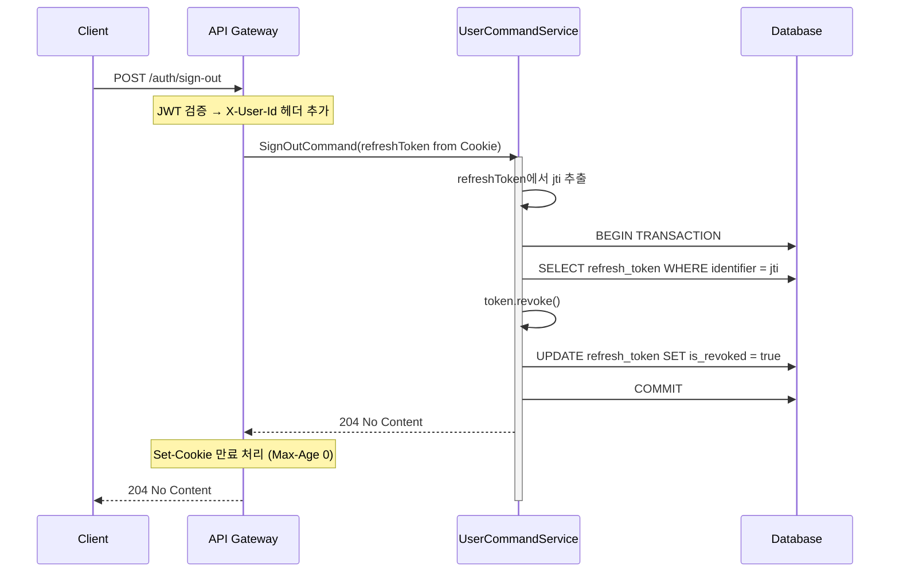
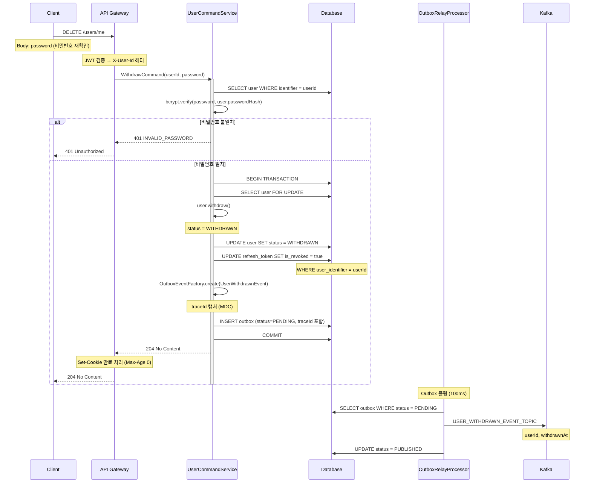
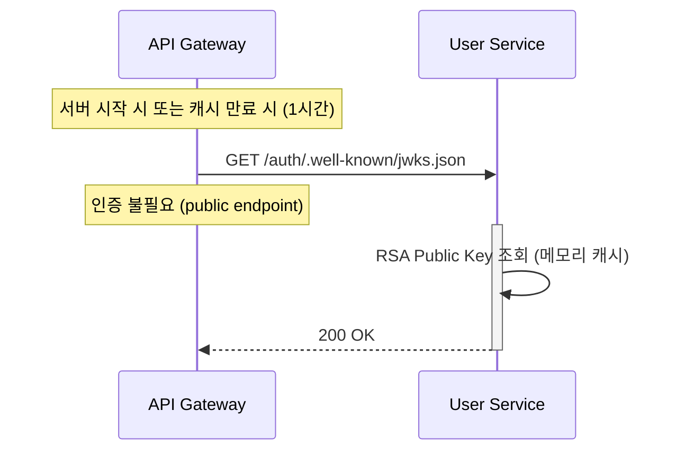
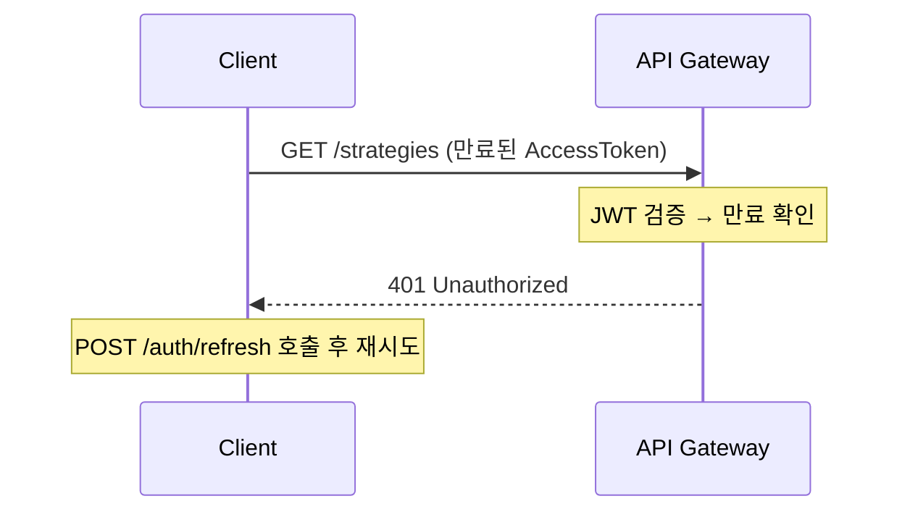
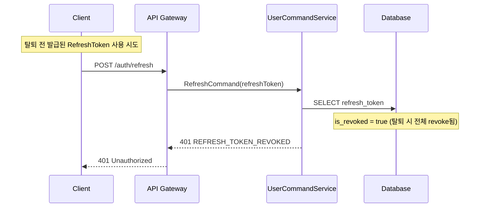

# User Service - 시퀀스 다이어그램

> User Service의 주요 시나리오별 상호작용 흐름

---

## 1. 회원가입 플로우

이메일 인증 없이 가입 즉시 `ACTIVE` 상태로 생성된다.



---

## 2. 로그인 플로우



---

## 3. 토큰 갱신 플로우



### 동시성: Refresh Token 중복 사용 방어



> `SELECT FOR UPDATE` 없이 낙관적 접근.
> 두 번째 요청은 `isRevoked = true`로 거부된다.
> 탈취 감지 시 해당 userId의 전체 RefreshToken을 revoke 처리하는 것을 권장한다.

---

## 4. 로그아웃 플로우



---

## 5. 회원 탈퇴 플로우

탈퇴는 `UserWithdrawnEvent`를 Outbox 패턴으로 발행하여 각 서비스의 데이터 정리를 트리거한다.



---

## 6. JWKS 엔드포인트

API Gateway가 JWT 서명 검증에 사용하는 Public Key를 JWK Set 형식으로 제공한다.



**응답 형식 (JWK Set)**:
```json
{
  "keys": [
    {
      "kty": "RSA",
      "use": "sig",
      "alg": "RS256",
      "kid": "key-2024-01",
      "n": "...",
      "e": "AQAB"
    }
  ]
}
```

> `kid` (Key ID)를 포함하여 키 로테이션 시 구버전/신버전 키를 동시에 제공할 수 있다.

---

## 7. 트랜잭션 범위

### 7.1 회원가입

```
BEGIN
  INSERT user (ACTIVE)
COMMIT
```

### 7.2 로그인

```
비밀번호 검증 (트랜잭션 없음)
BEGIN
  INSERT refresh_token
COMMIT
→ AccessToken 반환 (트랜잭션 외부)
```

### 7.3 토큰 갱신

```
BEGIN
  UPDATE refresh_token (revoke 기존)
  INSERT refresh_token (신규)
COMMIT
→ Token 반환 (트랜잭션 외부)
```

### 7.4 로그아웃

```
BEGIN
  UPDATE refresh_token (revoke)
COMMIT
```

### 7.5 회원 탈퇴

```
BEGIN
  UPDATE user (WITHDRAWN)
  UPDATE refresh_token (전체 revoke)
  INSERT outbox (UserWithdrawnEvent + traceId)
COMMIT
→ Outbox Relay가 Kafka 발행 (별도 스레드)
```

---

## 8. 예외 처리 플로우

### 8.1 만료된 Access Token으로 요청



### 8.2 탈퇴 사용자의 Refresh Token 재사용 시도



---

## 참고

- **비밀번호 해싱**: bcrypt (cost factor: 12)
- **Access Token**: RS256, 15분 만료
- **Refresh Token**: SHA-256 해시 DB 저장, 30일 만료, HttpOnly Cookie
- **이메일 인증**: 없음 (가입 즉시 ACTIVE)
- **Outbox**: `withdraw()` → `UserWithdrawnEvent` 발행 보장
- **분산 트레이싱**: Outbox traceId 캡처 → Relay에서 `traceparent` 헤더 복원
